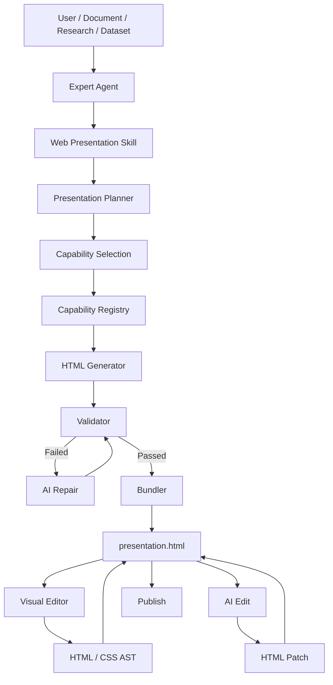
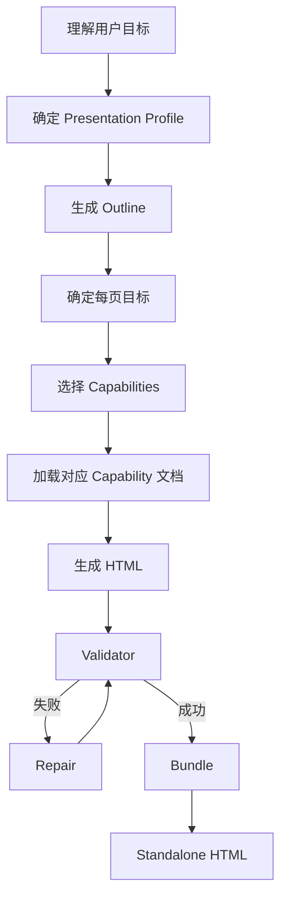
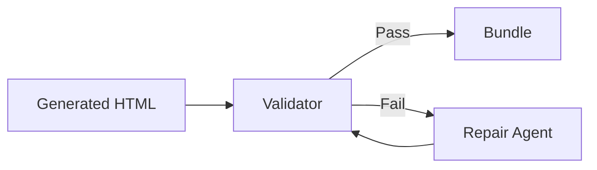

# AI Web Presentation 技术设计文档

> 项目：AI Native Knowledge & Digital Asset Workspace  
> 模块：Web Presentation / H5 在线演示  
> 版本：V1.0  
> 日期：2026-08-17  
> 状态：技术方案评审稿

## 1. 背景

平台需要提供一种区别于传统 PowerPoint / PPTX 的在线演示能力，主要服务于 Markdown 文档、HTML 文档、Research Report、Dataset / 行业数据分析、Knowledge Base 内容、Expert Agent 输出，以及用户 Prompt 直接生成等场景。

最终产物不是 PPTX，而是一个可独立访问、可发布、可分享、可运行的 Web/H5 演示文档。

核心目标不是重新实现 PowerPoint 或 Canva，而是利用 AI 的代码生成能力，直接生产具有丰富布局、动画、Hover、交互、动态图表和响应式能力的 Web Presentation，同时保留普通用户所需的轻量可视化精修能力。

## 2. 核心设计结论

整体方案采用：

> **Single HTML Artifact + Presentation Skill + Capability Registry + SG Runtime + Validator + Visual Editor + AI Patch**

最终交付物始终只有一个：

```text
presentation.html
```

该 HTML 内可包含 HTML、CSS、JavaScript、SVG、JSON 数据、图表初始化逻辑、动画逻辑、交互逻辑、页面导航 Runtime、平台标准 Runtime，以及按需内联的第三方依赖。

最终 HTML 应能够脱离编辑器独立运行。

## 3. 设计原则

### 3.1 HTML 是最终 Artifact

系统不以 PPTX、Canvas JSON 或自定义 Presentation DSL 作为最终交付格式。最终产物为 `presentation.html`。

优势包括：

- 浏览器直接运行
- 天然支持动画与交互
- 天然支持响应式
- URL 分享方便
- 可嵌入其他站点
- 可作为普通数字资产长期保存
- AI 对 HTML / CSS / JS 生成能力成熟
- 可支持高级 Web 能力

### 3.2 不让 AI 任意选择技术栈

不能采用：

```text
Prompt
  ↓
LLM
  ↓
任意 HTML / 任意 CDN / 任意 JS 库
```

必须采用封闭能力环境：

> **平台定义可使用的能力，AI 决定如何组合这些能力。**

### 3.3 AI 负责创造，Visual Editor 负责精修

产品不是 Low-code Web Builder。

AI 应承担页面设计、内容布局、复杂样式、动画设计、Web 交互、Hover 行为、数据可视化、响应式优化和页面整体重构。

Visual Editor 负责修改文字、替换图片、修改链接、页面排序、颜色、字体、基础间距、简单布局、基础 Hover、基础动画和 Theme。

复杂修改重新交由 AI。

### 3.4 Code First

对于确定性能力，优先通过代码完成，而不是 LLM，例如 DOM 修改、CSS Variable 修改、页面排序、图片 URL 替换、文本修改、HTML AST 修改、Validator、Bundle、Dependency Inline、基础动画切换和基础 Hover 切换。

只有开放式设计问题才调用模型。

## 4. 总体架构



## 5. Presentation Skill

### 5.1 定位

`web-presentation` Skill 是 AI 生成和修改在线演示的统一入口。

它不是一个简单 Prompt，而是一套完整的 Presentation Generation Pipeline，负责告诉 Agent：

- 什么情况下应该生成 Web Presentation
- 如何分析内容
- 如何规划页面
- 可使用哪些平台能力
- 如何生成 HTML
- 如何执行校验
- 校验失败如何修复
- 如何修改已有 Presentation
- 如何优化性能和移动端体验

### 5.2 Skill 操作模式

首期支持四类 Operation。

**CREATE**：创建完整演示。

**EDIT**：修改已有演示，支持 `element / page / presentation` 三种 Scope。

**REPAIR**：根据 Validator 或 Runtime Error 自动修复。

**OPTIMIZE**：用于移动端优化、性能优化、视觉优化和 Accessibility，可放 P1。

## 6. Skill 目录设计

```text
web-presentation/
│
├── SKILL.md
├── references/
│   ├── runtime.md
│   ├── authoring-protocol.md
│   ├── design-guidelines.md
│   ├── responsive.md
│   ├── accessibility.md
│   └── security.md
├── capabilities/
│   ├── chart.md
│   ├── animation.md
│   ├── hover.md
│   ├── scroll.md
│   ├── timeline.md
│   ├── map.md
│   ├── video.md
│   ├── embed.md
│   └── 3d.md
├── profiles/
│   ├── research.md
│   ├── pitch.md
│   ├── product-launch.md
│   ├── data-story.md
│   └── report.md
├── templates/
│   └── runtime-shell.html
└── scripts/
    ├── validate
    ├── bundle
    └── optimize
```

## 7. Skill 执行流程



## 8. Presentation Profile

### Research
- 信息密度较高
- 图表多
- Evidence / Source 明确
- 动画克制
- 强调结论与数据

### Pitch
- 大字号
- 强视觉
- 少文字
- 节奏明显
- 适合融资、路演、提案

### Product Launch
- 大面积视觉
- 产品截图
- 强动画
- Scroll Storytelling
- Interactive Demo

### Data Story
- Chart 为核心
- Hover
- Scroll Driven Animation
- 数据联动
- 时间轴
- 地图

## 9. Capability Registry

### 9.1 目标

禁止模型自由选择任意第三方库。平台维护统一 `Capability Registry`，AI 只能使用已批准能力。

### 9.2 示例

```yaml
runtime:
  html: true
  css: true
  javascript: true

capabilities:
  chart:
    implementation: SG.chart
    engine: ECharts

  animation:
    implementation: SG.animate
    engine:
      - Web Animations API
      - GSAP

  tooltip:
    implementation: SG.tooltip

  presentation:
    implementation: SG.presentation

  three:
    implementation: Three.js
    level: advanced
```

## 10. 技术能力分级

### Level 1：Native Web

AI 可以直接使用 HTML5、CSS3、Flex、Grid、CSS Variables、Media Queries、Container Queries、CSS Transition、CSS Animation、Vanilla JavaScript、DOM API 和 SVG。

### Level 2：SG Standard Capability

推荐优先使用平台封装能力：

```javascript
SG.chart()
SG.animate()
SG.tooltip()
SG.counter()
SG.tabs()
SG.carousel()
SG.presentation()
```

优点：
- 行为一致
- Theme 一致
- 响应式统一
- 易于 Visual Editor 识别
- 易于升级
- AI 生成更稳定

### Level 3：Advanced Capability

仅复杂场景启用：
- GSAP / ScrollTrigger
- Three.js
- 高级 SVG
- Canvas
- WebGL

必须来源于 Approved Dependency Registry。

## 11. SG Runtime

SG Runtime 是 Presentation HTML 的标准运行时。

Skill 负责告诉 AI 怎么生成；SG Runtime 真正提供运行能力。

示例：

```javascript
SG.chart('#market-chart', {
  type: 'line',
  data: marketData,
  interactive: true
});

SG.animate('.metric', {
  enter: 'fade-up',
  stagger: 100
});

SG.tooltip('.company-card', {
  trigger: 'hover'
});

SG.presentation({
  mode: 'slide',
  keyboard: true,
  touch: true
});
```

## 12. Authoring Protocol

为了让 Visual Editor 和 AI 能够可靠定位元素，使用一层非常薄的编辑协议：

```text
data-sg-*
```

### Page

```html
<section data-sg-page="market" data-sg-id="page-market">
</section>
```

### Text

```html
<h1 data-sg-id="market-title" data-sg-kind="text">
  新能源汽车市场规模
</h1>
```

### Image

```html

```

### Chart

```html
<div data-sg-id="market-chart" data-sg-kind="chart"></div>
```

`data-sg-*` 只负责编辑语义。即使删除所有 `data-sg-*`，HTML 仍然应该可以正常运行，因此它不是 Presentation Schema，也不是 Renderer DSL。

## 13. Opaque Code Island

复杂区域可标记：

```html
<div
  data-sg-id="interactive-map"
  data-sg-kind="code-island"
>
  ...
</div>
```

Visual Editor 对 Code Island 只支持：
- 选中
- 移动
- 隐藏
- 删除
- 复制
- AI 修改
- AI 重构

不要求用户深入编辑其内部所有 DOM。

## 14. 可编辑能力分级

### Level 1：完全可视化

- Text
- Heading
- Image
- Button
- Link
- Metric
- Quote

### Level 2：受控组件

- Card
- Grid
- Timeline
- Chart
- Table
- Tabs
- Accordion
- Carousel

支持有限配置：内容、Layout、Color、Style、简单 Interaction。

### Level 3：AI Code Island

- 3D 地球
- 粒子动画
- D3 高级可视化
- Scroll Storytelling
- Canvas
- WebGL
- 高级 SVG

主要由 AI 维护。

## 15. Visual Editor

Visual Editor 不是从零创建 H5 的 Low-code Builder，而是：

> **AI 生成后的精修工具。**

基础 UI：

```text
┌────────────┬──────────────────────────────┬──────────────┐
│ Pages      │                              │ Properties   │
│            │                              │              │
│ 01 Cover   │                              │ Content      │
│ 02 Market  │       Live Web Preview       │ Design       │
│ 03 Players │                              │ Animation    │
│ 04 Trends  │                              │ Interaction  │
│            │                              │ AI           │
└────────────┴──────────────────────────────┴──────────────┘
```

### P0 支持

内容：
- Text
- Image
- Link

页面：
- 新增
- 删除
- 复制
- 排序

Design：
- Theme
- Font
- Color
- Spacing
- Alignment
- Background
- Radius

Animation：
- None
- Fade
- Fade Up
- Slide
- Scale

Hover：
- None
- Lift
- Glow
- Scale
- Border

AI：
- 修改选中元素
- 修改当前页面
- 重做当前页面
- 修改整个演示

### V1 暂不实现

- PowerPoint Ribbon
- 完整 Layers 面板
- 任意绝对定位拖拽
- Pen Tool
- Vector Editor
- 任意 Shape
- 任意 Rotate
- 完整 Animation Timeline
- Master Slide
- 完整 CSS Editor

## 16. HTML 编辑模型

最终 Artifact 是 HTML，但编辑器内部不能通过 Regex 或字符串替换维护页面。

```text
HTML
 ↓
Parser
 ↓
DOM / AST
 ↓
Editor Command
 ↓
AST Mutation
 ↓
Serialize
 ↓
HTML
```

建议：
- HTML：parse5 / DOMParser / rehype / hast
- CSS：PostCSS AST
- JavaScript：必要时 Babel Parser / Acorn / SWC Parser

P0 尽量避免对复杂 AI JavaScript 做 AST 级可视化编辑。

## 17. Editor Command 与 Undo / Redo

例如修改标题：

```typescript
updateText({
  id: 'market-title',
  value: '越南消费金融市场趋势'
});
```

所有人工 Visual Edit 都应经过 Command History：

```text
Editor Action
 ↓
Command
 ↓
History
 ↓
AST
```

支持 Undo / Redo。

## 18. Theme

Theme 主要通过 CSS Variables 管理：

```css
:root {
  --sg-primary: #7c5cff;
  --sg-background: #08090c;
  --sg-text-primary: #ffffff;
  --sg-text-secondary: #9b9ca5;
  --sg-radius-sm: 8px;
  --sg-radius-md: 16px;
  --sg-radius-lg: 24px;
  --sg-font-title: 64px;
  --sg-font-body: 18px;
}
```

Visual Editor 和 AI 都修改同一套 Theme 系统。

## 19. 基础动画协议

```html
<div
  data-sg-enter="fade-up"
  data-sg-duration="600"
  data-sg-delay="100"
>
</div>
```

Visual Editor 只修改这些属性。复杂动画由 AI 修改 CSS / JS / GSAP。

## 20. 基础 Hover 协议

```html
<div data-sg-hover="lift"></div>
```

Visual Editor 提供：
- None
- Lift
- Glow
- Scale
- Border

复杂 Hover，例如“Hover 公司后联动地图和 Chart”，直接交由 AI 修改 JavaScript。

## 21. AI 修改机制

AI 修改不能每次重新生成整个 HTML，应支持局部上下文 Patch。

例如用户选中：

```text
data-sg-id="market-chart"
```

系统只提供：
- Target HTML
- 相关 CSS
- 相关 JavaScript
- 当前 Theme
- 用户需求

支持 Scope：

```text
element
page
presentation
```

优先使用最小 Scope，以降低 Token、延迟、风险和修改漂移。

## 22. Revision 与 Diff

每次 AI 修改：

```text
Snapshot
 ↓
AI Patch
 ↓
Revision
```

用户支持：
- 查看 Diff
- 接受
- 撤销

Revision 可以保存在平台数据库，不要求嵌入最终 HTML。

## 23. Validator

Prompt 不是安全边界。所有 AI HTML 必须经过 Validator。

### Dependency Validation
禁止未经批准的外部 `<script src>`、`<link href>`。

### JavaScript Validation
按策略检查：
- eval
- new Function
- 动态 Script
- document.write
- 危险 iframe
- 未授权 window.open

### Network Validation
检查：
- fetch
- XMLHttpRequest
- WebSocket
- EventSource

默认禁止，按白名单开放。

### HTML Validation
检查：
- `data-sg-id` 是否唯一
- Page 是否包含 ID
- HTML 是否完整
- Editable Element 是否符合协议

### CSS Validation
检查：
- 外部 url()
- 危险 import
- 未批准远程字体

## 24. Validator + Repair



例如：

```text
EXTERNAL_DEPENDENCY_NOT_ALLOWED
anime.js
```

自动反馈：

```text
Anime.js is unavailable.
Replace it with SG.animate().
```

直到通过。

## 25. Bundler

生成阶段可以引用逻辑 Runtime：

```javascript
SG.chart(...)
```

最终发布时：

```text
Generated HTML
+
SG Runtime
+
Approved Dependencies
+
Assets
       ↓
      Bundle
       ↓
presentation.html
```

只有实际使用的能力才 Bundle，避免把 Three.js、Carousel 等未使用能力全部内联。

## 26. 单 HTML 输出

最终结构示例：

```html
<!doctype html>
<html>
<head>
  <style>
    /* Theme */
    /* Components */
    /* Page styles */
  </style>
</head>

<body>

<section data-sg-page="cover">
  ...
</section>

<section data-sg-page="market">
  ...
</section>

<script>
  /* SG Runtime */
  /* Approved runtime dependencies */
  /* Presentation JS */
</script>

</body>
</html>
```

## 27. 图片与 Asset

支持两种策略。

### URL 引用
适合平台在线发布、OSS/CDN，HTML 更小。

### Base64 / Data URI
适合真正离线单文件下载，但文件体积更大。

平台可根据发布方式决定是否 Inline。

## 28. Runtime 技术选择

AI Artifact 默认使用：

```text
HTML
CSS
Vanilla JavaScript
```

而不是 React Runtime。

原因：
- 单文件更自然
- Runtime 更小
- 无 React 版本依赖
- AI 生成稳定
- AST 更简单
- Browser 直接执行
- 无 hydration
- Bundle 更容易控制

编辑器本身仍然可以使用 React + TypeScript。

## 29. 图表、动画、3D

### 图表
默认 ECharts，通过 `SG.chart()` 封装。

### 动画
默认 CSS Animation + Web Animations API；高级场景使用 GSAP / ScrollTrigger。

### 3D
P1 按需支持 Three.js，只在 Planner 判断确实需要时加载，避免普通页面默认引入导致体积和性能问题。

## 30. Preview Sandbox

AI 生成的 HTML 必须运行在 Sandbox iframe。

建议：
- 独立 Origin
- CSP
- Sandbox Attribute
- 网络白名单
- 限制 Storage
- 限制 Popup
- 限制下载
- 限制外部跳转

发布后的 Presentation 也建议运行于独立域名，避免获得主站 Cookie、LocalStorage、Session 和内部 API 权限。

## 31. Presentation 页面结构

一个 HTML 中使用：

```html
<section data-sg-page="cover"></section>
<section data-sg-page="market"></section>
<section data-sg-page="competition"></section>
```

页面导航 Runtime 扫描 `[data-sg-page]` 即可得到页面列表。

页面排序本质上只是调整对应 `<section>` 在 AST 中的顺序，无需独立 Presentation Schema。

## 32. Presentation Mode 与 Scroll Mode

同一个 HTML 可以提供两种展示模式。

### Presentation Mode
- 16:9 / Fullscreen
- Keyboard
- Touch
- Page Transition
- Presenter

适合汇报、路演、投屏。

### Scroll Mode
- 响应式
- 连续滚动
- Mobile Friendly
- URL 阅读

适合微信分享、浏览器阅读、异步阅读。

## 33. 数据来源与平台 Asset 融合

Presentation 可来源于：

```text
Document
Research
Dataset
Knowledge
Agent Result
Manual Prompt
```

在平台中保存为 `Presentation Asset`。

元信息包括：
- ID
- Name
- Owner
- Version
- Source Asset
- Published URL
- Visibility
- Tags
- CreatedAt
- UpdatedAt

内容主体：

```text
presentation.html
```

如果来源 Research / Document 发生变化，可提示“来源内容已变化，是否同步更新演示？”，同步应优先通过 AI Patch，而不是强制重建。

## 34. 数据与展示分离

虽然最终只有一个 HTML，但生成阶段应区分：

```text
Content
Design
Data
Interaction
```

结构化数据可以内嵌为：

```html
<script type="application/json" id="sg-data-market">
...
</script>
```

最终仍然属于同一个 HTML。

## 35. 复杂演示的生成策略

不建议一次生成完整 HTML。

推荐：

```text
Outline
  ↓
Page Plan
  ↓
Page Generate
  ↓
Merge
  ↓
Validate
```

最终 Merge 后仍然只有一个 HTML。

## 36. Capability Selection

例如用户说：

> 做一个越南消费金融市场演示，要动态图表、公司 Hover 和趋势动画。

Planner 输出：

```json
{
  "capabilities": [
    "chart",
    "hover",
    "animation",
    "responsive"
  ]
}
```

然后 Skill 只加载对应 Capability 文档，避免把所有能力说明一次性塞给模型。

## 37. 模型策略

可拆分：

- Outline：中等能力模型
- 页面设计 / HTML Generation：强模型
- Repair：中等或代码模型
- 简单文本编辑：低成本模型

结合平台 Model Router 控制成本。

## 38. 性能与响应式

性能目标：
- 首屏快速加载
- 不使用未使用依赖
- 大图片自动压缩
- 图表按需初始化
- 非首屏动画延后
- 3D / Canvas 延迟加载
- Mobile 降级复杂动画

响应式最低支持 Desktop + Mobile 两套 Layout。

禁止简单将 16:9 Desktop 页面整体缩小到手机。

## 39. MVP 范围

### P0

AI：
- CREATE
- EDIT Element
- EDIT Page
- EDIT Presentation
- REPAIR

Runtime：
- Presentation
- Chart
- Basic Animation
- Tooltip
- Basic Hover
- Responsive

Visual Editor：
- Text
- Image
- Link
- Page CRUD
- Page Sort
- Theme
- Font
- Color
- Spacing
- Alignment
- Basic Animation
- Basic Hover

Engineering：
- HTML Parser / AST
- CSS AST
- Validator
- Bundler
- Sandbox
- Revision / Undo
- Publish

### P1

- GSAP Advanced Animation
- Scroll Storytelling
- Chart Advanced Interaction
- Responsive Preview
- Code Island Management
- AI Optimize
- PDF Export
- Dataset Live Binding
- Theme Marketplace
- More Presentation Profiles

### P2

- Three.js
- Advanced WebGL
- Interactive Map
- Presentation Component Marketplace
- Team Brand Kit
- Custom Runtime Capability
- Custom Presentation Skill
- Enterprise Templates

## 40. 明确不做

首期不做：
- 完整 PowerPoint Clone
- 完整 Canva Clone
- 任意自由 Canvas Editor
- PPTX 作为核心数据格式
- 自研大型 Layout DSL
- 巨型 Presentation JSON Schema
- 任意外部 JS CDN
- 任意第三方 Dependency
- AI 无限制网络访问
- 编辑器运行 AI HTML 于主站 Origin

## 41. 风险与应对

### AI HTML 不稳定
通过 Skill、Capability Registry、Validator、Repair Loop、Runtime API 解决。

### Visual Editor 难以理解复杂 HTML
通过 Authoring Protocol、Editable Level、Code Island、AI Edit 解决。

### HTML 太大
通过 Tree Shaking、Asset URL、压缩、Lazy Init、Dependency Optimization 解决。

### AI Patch 破坏其他页面
通过 Stable `data-sg-id`、Scope Patch、Revision、Diff、Validator 解决。

### 安全风险
通过 Sandbox、CSP、独立 Origin、Validator、Network Allowlist、Dependency Registry 解决。

## 42. 最终技术决策

Editor：

```text
React
TypeScript
```

Presentation Artifact：

```text
HTML
CSS
Vanilla JavaScript
```

HTML Edit：

```text
DOM / AST
```

CSS Edit：

```text
PostCSS AST
CSS Variables
```

Standard Runtime：

```text
SG Runtime
```

Chart：

```text
ECharts
```

Animation：

```text
CSS
Web Animations API
GSAP（Advanced）
```

AI Control：

```text
web-presentation Skill
+
Capability Registry
```

Security：

```text
Validator
Sandbox iframe
CSP
Independent Origin
```

Final Artifact：

```text
presentation.html
```

## 43. 核心架构总结

```text
AI Presentation =

Presentation Skill
+
Capability Registry
+
HTML/CSS/JS
+
SG Runtime
+
Authoring Protocol
+
AST Visual Editor
+
AI Patch
+
Validator
+
Bundler
+
Sandbox
```

核心思想：

> **AI 负责创造，平台负责约束，Visual Editor 负责精修，HTML 负责最终表达。**

不重新发明 HTML，不重新发明 PowerPoint，不重新实现 Canva。

充分利用 AI 已经成熟的 Web Coding 能力，同时通过 Skill、Runtime 与 Validator 将这种能力约束到一个可维护、可编辑、可发布的产品体系中。
