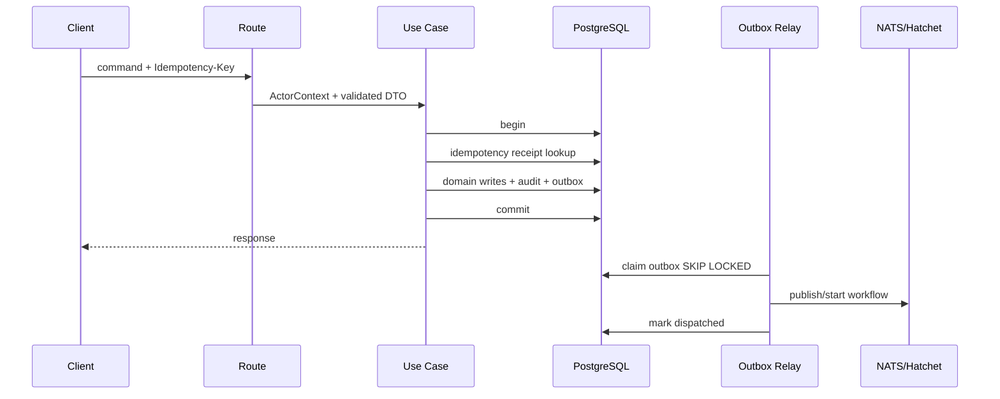

# `api` 应用技术设计

## 1. 定位

`apps/api` 是产品控制面和业务事实唯一写入口。它以模块化单体承载 Asset、Knowledge、Research、Task 读模型、Dataset 元数据、Presentation、Template、Publish、Notification、Credits、Integration 和 MCP 协议入口。

| 项 | 设计 |
| --- | --- |
| Runtime | Node.js 22+ |
| Framework | Fastify 5 plugin encapsulation |
| Validation | Zod/JSON Schema；OpenAPI 3.1 |
| Database | PostgreSQL、Kysely、SQL migrations |
| Async | Hatchet client、NATS JetStream Outbox relay |
| Internal RPC | ConnectRPC/gRPC client |
| External Agent | MCP Streamable HTTP；与产品 API 共进程、独立路由组 |
| Port | `3001` |

## 2. 为什么是模块化单体

Asset 创建、版本、关系、发布、Credits、通知经常需要同事务或同一权限上下文。MVP 拆成多个网络服务会引入分布式事务、重复鉴权和联调成本。模块化单体保留未来拆分所需的 application/repository/event 边界。

## 3. 目录

```text
src/
├── bootstrap/             # server、lifecycle、plugins
├── platform/
│   ├── identity/
│   ├── database/
│   ├── events/
│   ├── workflow/
│   ├── object-store/
│   ├── observability/
│   └── idempotency/
├── modules/<domain>/
│   ├── domain/            # entities/value objects/policies
│   ├── application/       # commands/queries/use cases
│   ├── infrastructure/    # repository/adapters
│   └── http/              # route/schema/presenter
├── internal-rpc/
└── main.ts
```

Domain 不依赖 Fastify、Kysely、NATS 或 Hatchet。HTTP handler 只做身份、校验、调用 use case 和映射 response。

## 4. 核心模块职责

| 模块 | 写模型 | 主要命令 |
| --- | --- | --- |
| assets | Asset/Version/Relation/Folder/Tag/ACL | create/update/version/delete/restore/relation |
| documents | draft/proposed patch | sync draft/apply AI patch/finalize version |
| knowledge | KB/Source/query/citation | add source/retry/search/ask |
| research | ResearchSpec | preview scope/start task |
| tasks | Task/Step/Attempt/ProjectionInbox | cancel/pause/resume/retry/project result |
| datasets | Dataset metadata/schema/view/chart | import/query/save view/create chart |
| presentations | slide document/theme/layout | create outline/apply/regenerate/publish |
| templates | Template/Version | preview/use/save version |
| publishing | Publish/Release/ShortLink | release/revoke/rotate slug/change policy |
| notifications | Notification/Preference | mark read/delivery status |
| billing | CreditAccount/Ledger/Reservation | reserve/settle/release/refund |
| integrations | API/MCP token/config/tool adapter | create/revoke/change scope/call tool |

## 5. 请求事务



Outbox relay 可在独立 process mode 或 `worker` 运行；不能在 HTTP commit 前发布。

## 6. 身份与授权

Fastify preHandler：

1. 校验网关注入 assertion；
2. 构建 `ActorContext(subject, workspace, org, entitlement, requestId)`；
3. route 声明 action；
4. use case 加载 resource policy；
5. repository 自动包含 workspace predicate，但不能替代 policy。

内部 service credential 与用户 assertion 分离。Public Gateway 只调用专门的 read endpoint，不获得通用 API 权限。

MCP 路由不接受浏览器 Cookie，只接受产品 API/MCP Bearer Token。它与 REST 共用 application
service、授权策略和审计，不直接访问 repository。为避免 MCP 长连接拖垮普通请求，路由组设置独立的
连接数、body/response bytes、idle timeout、token/IP/workspace rate limit；指标证明需要独立扩容或
协议故障影响 API SLO 时，再从同一 adapter 边界拆出进程。

## 7. 任务提交与投影

- 创建任务事务内写 `tasks`、Credit reservation、Outbox。
- Hatchet run id 回写是幂等 command；即使启动确认丢失，可由 dispatcher 按业务 key 查询/重试。
- Worker result 只经 `/internal/v1/task-results:project` 进入，校验 HMAC/mTLS、schema、blob hash、run/attempt。
- Projector 以 `projection_inbox.event_id` 唯一，并在同事务生成 Asset/Relation/ledger/outbox。

## 8. 搜索与 Ask

- `search_assets` 统一搜索 Asset metadata/FTS，按权限预过滤；
- Knowledge hybrid search 在 SQL transaction 中设置 `hnsw.ef_search` 等查询级参数；
- Answer 请求提交给 model-gateway，context 只包含授权 chunk；
- Citation 先落结构化 locator，再由模型引用 citation token；后处理验证每个 citation 存在。

## 9. 对象存储

API 只管理 upload session、metadata、signed URL 和 version 引用：

- 不代理大文件流；
- complete 前校验 key/size/hash；
- quarantine 未通过不能成为 Ready Asset；
- 下载/发布只返回短时 URL 或 public route；
- S3 adapter 不暴露 SeaweedFS 专有类型。

## 10. API 设计

主要资源：

```text
/api/v1/assets
/api/v1/assets/{id}/versions
/api/v1/knowledge-bases
/api/v1/research/specs:preview
/api/v1/tasks
/api/v1/datasets/{id}/query
/api/v1/presentations
/api/v1/templates
/api/v1/publishes
/api/v1/notifications
/api/v1/credits
/api/v1/integrations/tokens
/api/v1/events (SSE)
/mcp (Streamable HTTP)
```

POST command 使用幂等 key；PATCH 使用 `If-Match`；列表 cursor pagination；错误遵循 Problem Details。内部接口位于 `/internal/v1`，边缘网关不可公网路由。

## 11. 性能与扩容

- PostgreSQL pool 每实例有硬上限，部署扩容时保持总连接预算；
- read-heavy list 使用覆盖索引和预计算 projection，不做 N+1；
- JSON 正文和 blob 不进普通查询；
- global search/query 设置 statement timeout；
- 每 workspace/actor rate limit，Research/Ask 另有成本限流；
- API 无状态，多副本滚动升级。

## 12. 测试

- Domain unit/property tests：状态机、ACL、Credits invariant；
- Repository integration：真实 PostgreSQL + pgvector、migration；
- Route contract：OpenAPI snapshot + generated client；
- Async integration：Outbox/NATS/Hatchet result projection/redelivery；
- Security：IDOR、scope、malformed assertion、internal endpoint exposure；
- Failure injection：commit 后 publish 前崩溃、重复 result、S3 complete 丢失、NATS redelivery。

## 13. 未来拆分判据

Publishing、Knowledge 或 Billing 只有在独立团队/SLO/容量显著不同且事件契约稳定后才拆。拆分前必须先将模块 database access、contract test 和 outbox 边界完全收紧。
