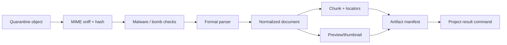

# `compute-worker` 应用技术设计

## 1. 定位

`apps/compute-worker` 是 Go 计算执行应用，合并不可信内容处理与 Dataset Engine。它负责解析、抽取、
分块、预览、导出、静态检查，以及基于 DuckDB/Parquet 的导入、画像和确定性查询。它不接收公网请求，
业务元数据和权限仍由 `api` 管理。

| 项 | 设计 |
| --- | --- |
| Runtime | Go 1.24+ |
| Work interface | Hatchet Go worker |
| Query interface | ConnectRPC/gRPC，仅私网 |
| Data engine | DuckDB 固定版本、Parquet |
| Storage | SeaweedFS S3 API、本地有界 cache/temp |
| Security | quarantine、MIME sniff、ClamAV、进程/容器资源限制 |

## 2. 为什么首期合并

内容处理与 Dataset Engine 都需要 Go、对象存储、大文件流式 IO、临时磁盘、资源配额和 artifact
manifest。首期合并可复用下载、hash、cache、quota、观测和安全沙箱。两类负载仍保持内部模块、接口和
执行池隔离：

```text
apps/compute-worker/
├── cmd/compute-worker/
├── internal/content/   # parser、chunk、preview、render、scan
├── internal/data/      # import、profile、query AST、DuckDB
├── internal/artifact/  # blob、manifest、hash、cache
├── internal/sandbox/   # process/container limits
└── internal/platform/  # Hatchet、RPC、OTel、config
```

部署可用同一镜像设置 `COMPUTE_PROFILE=content|data|all`，将低延迟查询和长时间解析调度到不同实例池。

## 3. Content Pipeline



支持 Markdown/HTML/PDF/Office/图片/URL snapshot 的规范化。每阶段输出 content-addressed artifact；
输入 hash 与 parser version 相同则复用。NormalizedDocument 包含 block tree、plain text、heading
path、page/slide/sheet locator、media refs 和 warnings。

外部解析二进制运行在非 root、只读 rootfs、默认无网络的受限进程/容器；限制压缩比、页数、像素、
嵌套深度、CPU、内存、wall time、临时目录和输出大小。用户脚本绝不在 Compute Worker 执行。

## 4. Dataset Pipeline

1. 校验 workspace scope、object key、size、hash 和格式；
2. 检测 CSV/JSON/XLSX encoding、delimiter、header；
3. sample 推断 schema，生成用户可调整的 proposal；
4. 严格转换，无法转换值记录 quality issue；
5. 写不可变 Parquet；
6. 生成 row count、min/max/null/distinct/sample；
7. 返回 manifest，由 API 创建 DatasetVersion。

DatasetVersion Ready 后 schema 与 Parquet 不可变，修改生成新版本。

## 5. Query API 与安全

内部 Query API 只接受结构化 AST：projection、typed filter、sort、group、aggregate、limit/offset。
Compiler 根据 schema 验证列 ID/type、operator allowlist 和参数值，禁止 raw SQL、DDL、COPY、ATTACH、
extension、filesystem/network function。

初始预算：返回不超过 1,000 行、projection 不超过 200 列、wall time 不超过 10 秒，并限制 memory、
threads、temporary spill、workspace 并发和扫描字节。具体数值配置化并经压测校准。

AI 只能提出同一 AnalysisPlan/Query AST；均值、同比、排名和异常阈值由引擎确定性计算，模型只解释结果。

## 6. 缓存与隔离

- cache key：`datasetVersionId + contentHash`；
- 下载后校验 hash，再原子 rename 为只读文件；
- LRU 按字节淘汰，查询中的 entry pin；
- 每次 RPC 仍校验 API 签发的短时 capability；
- `content` 与 `data` profile 使用不同 queue、并发、timeout、memory 和 temp quota；
- Data RPC 具有最高并发保护，避免大文件 render 造成 head-of-line blocking。

## 7. 输出契约

内容与数据结果统一使用版本化 manifest，至少包含：source content hash、processor/engine version、
artifact object key/hash、schema、warnings/quality issues、resource usage。API Projector 重新验证 schema、
task scope、hash 和 object prefix 后才生成业务版本。

## 8. 错误与降级

- `INVALID_INPUT/QUERY_PLAN`：永久失败，不重试；
- `RESOURCE_LIMIT_EXCEEDED`：提示缩小文件/范围；
- `OBJECT_HASH_MISMATCH`：永久失败并安全告警；
- `ENGINE_BUSY`：返回 retry-after；
- `TRANSIENT_STORAGE`：有界重试；
- Dataset Query 不可用只影响交互查询，其他 Asset 读写和公开发布不受影响。

## 9. 拆分触发条件

只有在 profile 隔离后仍出现以下情况才拆出 `data-engine`：

- 长解析持续影响 Dataset Query SLO；
- DuckDB CGO/依赖与解析工具链造成发布或稳定性冲突；
- 两类负载需要不同节点、网络或安全凭据；
- Data Engine 已有独立团队与稳定 RPC/manifest contract。

## 10. 测试

- 每格式 golden fixture、locator、parser determinism；
- zip bomb、polyglot、malformed XML/PDF、MIME spoof、path traversal；
- Query AST property/fuzz，证明不能逃逸 allowlist；
- decimal/null/timezone 和查询结果确定性；
- 100k/1m 行基准、并发、spill、cancel、timeout；
- cache hash/eviction/race；
- profile 资源隔离和大文件压测；
- duplicate activity、artifact reuse 与 Projector contract test。
