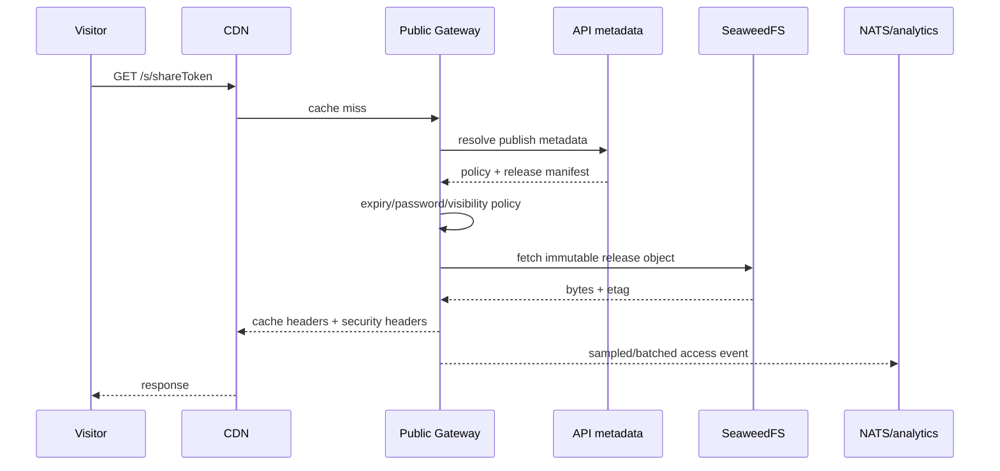

# `public-gateway` 应用技术设计

## 1. 定位

`apps/public-gateway` 是首期独立部署的匿名/公开内容高并发数据面，提供稳定 URL、短链、密码/有效期、静态文档/HTML/Presentation 分发和访问事件。它必须位于独立 user-content registrable domain，不能作为 `api` 的路由模块运行。

| 项 | 设计 |
| --- | --- |
| Runtime | Go 1.24+，`net/http`/chi |
| Storage | S3-compatible SeaweedFS，release bundle 不可变 |
| Metadata | API internal read/cache；不使用通用 DB credential优先 |
| Cache | CDN + signed local metadata cache |
| Port | 本地 `3004` |

## 2. 路由

```text
GET /s/{shortSlug}               # 用户可见的分享入口（内部代理，不重定向）
GET /s/{shortSlug}/r/{refKey}    # 当前 release 的引用文档快照
GET /s/{shortSlug}/assets/{path...} # 当前 release 静态资源
GET /p/{slug}                    # 兼容/内部 canonical 入口
GET /p/{slug}/assets/{path...}   # 兼容/内部静态资源入口
POST /s/{shortSlug}/unlock       # 分享入口密码校验
POST /p/{slug}/unlock            # 兼容入口密码校验
GET /health/live
GET /health/ready
```

slug 解析结果：publishId、activeReleaseId、visibility、expiresAt、passwordVersion、cache policy、manifest ref。Release 切换通过修改小型指针完成，静态内容 key 含 releaseId。

## 3. 请求流程



## 4. 可见性

- Public/Unlisted：匿名访问；Unlisted 只是不索引，不能当安全权限；
- Password：Argon2id 校验在 API/受限 metadata service，成功签发 publish-bound、短时、HttpOnly cookie；
- MemberOnly/Private：跳回 trusted app domain 走统一 Auth，Public Gateway 不接收主域 Cookie；
- Expired/Revoked/Deleted：友好 404/410，响应不可被公共缓存；
- Owner preview：使用短时 signed preview token，不能混入公开 URL。

## 5. HTML/Presentation

- HTML active content 使用 `sandboxed assets` host，响应严格 CSP；
- Release manifest 明确 entrypoint、media type、hash、size、CSP policy；
- 禁止目录穿越、隐藏 key、任意 S3 proxy；path 必须命中 manifest；
- Presentation 是可信 renderer 生成的静态 bundle，自定义脚本仍按 HTML active content 策略；
- 用户上传附件默认 attachment；白名单图片/字体可 inline。

## 6. Cache

- hashed static asset：`public,max-age=31536000,immutable`；
- `/p/{slug}` shell：短 TTL + stale-while-revalidate，etag 含 release id；
- password/private/expired：`private,no-store`；
- release switch/revoke 发布 NATS purge event，但正确性不依赖 purge：短 TTL 和 metadata version 最终阻止旧入口；
- 本地 metadata cache key 含 policy version，最大 TTL 30–60 秒，revocation 用 push invalidation。

## 7. 访问分析

数据最小化：publishId/releaseId、timestamp bucket、referrer domain、country/region 粗粒度、device class、hashed visitor/day。IP 仅用于实时防滥用，不长期保存原值。事件批量异步发送；analytics 故障不能阻塞内容响应。

UV cookie/identifier 遵守隐私和 consent 策略。Umami 可承载基础访问分析，产品内 daily stats 保存展示所需聚合。

## 8. 安全 Header

- `Content-Security-Policy` 按 release；
- `X-Content-Type-Options: nosniff`；
- `Referrer-Policy: strict-origin-when-cross-origin` 或更严；
- `Permissions-Policy` 默认关闭 camera/mic/geolocation 等；
- `Cross-Origin-Resource-Policy`/`Cross-Origin-Opener-Policy` 按内容；
- user-content 域无主域 cookie，CORS 默认关闭；
- Host allowlist、防 cache poisoning、规范化路径、header size limit。

## 9. 性能和故障

- 静态响应尽量流式从 S3 到客户端，限制 range 和并发；
- metadata/API timeout 短、stale cache 仅允许仍未到期且未收到 revoke version 的 public entry；
- S3 不可用返回 503 + retry，不返回不完整页面；
- analytics/NATS 失败丢入有界本地 buffer 或采样丢弃，绝不耗尽内存；
- CDN 命中率、TTFB、origin bytes、404/410、unlock failure、S3 latency 为核心指标。

## 10. 测试

- slug/short link collision、expiry、revoke、release rollback；
- password brute-force/rate limit/cookie binding；
- path traversal、host/cache poisoning、MIME confusion、range abuse；
- HTML 不能访问 trusted domain Cookie/DOM/Storage；
- CDN header golden；
- S3 partial/error、metadata timeout、stale policy；
- 高并发/大文件/slow client；
- analytics failure 不影响主响应。
