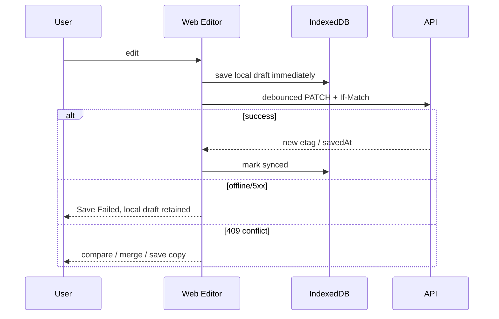

# `web` 应用技术设计

## 本地生产账号 Broker

需要用 localhost 调用本地 API、同时复用生产身份时，启用服务端 Broker：

```dotenv
ASSET_HUB_LOCAL_BROKER_ENABLED=true
ASSET_HUB_LOCAL_AUTH_USERNAME=<测试账号>
ASSET_HUB_LOCAL_AUTH_PASSWORD=<测试密码>
ASSET_HUB_AUTH_TARGET=https://shiguanglab.com
ASSET_HUB_LOCAL_API_TARGET=http://localhost:3001
DEV_AUTH=false
```

Vite 启动时用账号密码调用生产 `auth-service` 的 `/api/auth/local-broker`，只在
Node 进程内保存 opaque Broker，并定期刷新 `asset-hub-api` audience 的 1 分钟
身份断言。代理在转发 `/api/v1/*`、SSE、上传、下载和 `/mcp` 前删除浏览器提供的
`Cookie`、`Authorization`、`X-SG-Identity`，再注入线上签发的断言。

约束：

- 账号密码不得使用 `VITE_*` 前缀，不得进入浏览器 bundle、localStorage 或日志；
- Broker 模式只允许 Vite dev server，并强制监听 `127.0.0.1`；
- 修改账号只改根目录 `.env` 并重启 Web，不提供前端切换账号入口；
- 生产 Web 构建发现 Broker 开关会直接失败；
- Broker 仅支持服务端配置好的 `asset-hub / asset-hub-api / asset-hub:access`，
  不能传入 subject、audience 或 entitlement。

## 1. 定位

`apps/web` 是 Web ToC 主应用和移动 Web 适配层，负责 UI、编辑体验、本地草稿和实时状态呈现。它不是安全边界：所有权限、状态转换、Credits 和发布裁决必须由服务端完成。

| 项 | 设计 |
| --- | --- |
| Runtime | Browser；静态资源部署 CDN |
| 技术栈 | React 19、TypeScript、Vite、React Router、TanStack Query、Zustand（仅局部 UI） |
| UI | `@shiguang/ui` + design tokens；不直接复制 superagents 页面代码 |
| 编辑器 | CodeMirror 6、unified/remark/rehype、DOMPurify、Mermaid、KaTeX |
| 图表/表格 | ECharts、TanStack Table + Virtual |
| 实时 | SSE + query invalidation；AI 单次生成用 fetch streaming |
| 端口 | 本地 `3000` |

## 2. 页面域

```text
src/
├── app/                  # Router、providers、error boundaries
├── shell/                # 导航、Header、Command K、新建入口
├── features/
│   ├── home/
│   ├── assets/
│   ├── documents/
│   ├── html-assets/
│   ├── knowledge/
│   ├── research/
│   ├── tasks/
│   ├── datasets/
│   ├── presentations/
│   ├── templates/
│   ├── publishing/
│   ├── notifications/
│   ├── billing/
│   └── settings/
├── entities/             # Asset/Task/KB 等 UI model + query keys
├── shared/               # api client、SSE、draft store、i18n、a11y
└── workers/              # Markdown preview/search 等 Web Worker
```

feature 之间不得直接 import 内部组件；跨 feature 只通过 `entities` 和公开 barrel。Server state 只在 TanStack Query，Zustand 不复制 Asset/Task 权威数据。

## 3. UI 资料映射

72 张 UI 图展示了两套视觉方向（浅色资产工作区与深色任务/分析工作台）。实现时统一 token 体系并支持 light/dark，而不是为业务页面维护两套 DOM。关键交互：

- 首页：自然语言目标、Quick Create、运行中任务、最近内容；
- 全局新建：Document/HTML/KB/Research/Presentation/Upload + 最近模板；
- 编辑：Edit/Split/Preview/Source、AI 侧栏、保存状态；
- Research/Task：四步创建、可关闭页面、步骤级进度与输出；
- Dataset：概览、图表、质量、交互查询；
- Presentation：大纲确认、结构化编辑、Theme/Layout、播放；
- Publish：可见性、密码、有效期、短链、二维码、分析；
- Settings：MCP/API/Git/通知/Credits。

## 3.1 主题颜色规范（锁定）

Web 工作台默认使用近黑色暗黑主题，禁止将页面背景改为蓝色或藏青色。所有页面必须复用以下 token，不得在页面样式中重新定义一套蓝色背景：

| Token | 固定值 | 用途 |
| --- | --- | --- |
| `--sg-bg` | `#0B0A0F` | 页面主背景 |
| `--sg-bg-2` | `#121116` | 卡片、面板背景 |
| `--sg-bg-3` | `#1A181F` | 输入框、悬浮层背景 |
| `--sg-border` | `#2A2731` | 边框与分隔线 |
| `--sg-fg` | `#F4F3FB` | 主文字 |
| `--sg-fg-2` | `#B8B5C9` | 次级文字 |
| `--sg-muted` | `#777489` | 辅助文字 |
| `--sg-accent` | `#7C3CFF` | 主操作与选中态 |

主题锁定实现位于 `apps/web/src/styles/theme-lock.ts`。后续 UI 调整只能修改布局、间距和组件状态，不得改变上述颜色 token 或引入蓝色/藏青色页面背景。

## 3.2 Header 面包屑规范（锁定）

- 所有路由的面包屑统一渲染在全局 Header 左侧，位于搜索框之前；页面内容区不得重复渲染面包屑。
- 面包屑格式为“模块 > 当前页面名称”，模块和当前内容使用统一的 Header 样式；详情页通过 `useShellBreadcrumb` 提供动态名称，加载前使用明确的占位名称。
- 搜索、通知和新建操作统一位于 Header 右侧，不能挤占或改变面包屑的左侧定位。
- 只有首页显示聚合式“新建”入口；文档、HTML、知识库、调研、在线演示等具体页面必须显示对应的单一新建动作，不得重复展示入口聚合弹窗。
- 移动端仍保留面包屑，通过截断显示适配窄屏，不得恢复为内容区面包屑。

## 3.3 样式实现规范（锁定）

- Web 应用与 `@shiguang/ui` 的项目自有样式统一使用 `antd-style`，禁止新增业务 `.css` / `.less` 文件或在页面入口导入项目自有 CSS。
- 组件内聚样式优先使用 `createStyles`；跨组件基础样式、第三方组件覆盖和需要保留稳定类名的兼容层使用 `createGlobalStyle`。
- 全局样式必须按业务模块拆分并由 `ThemeProvider` 统一挂载，禁止重新建立单体 `styles.css`。
- 颜色、间距、圆角和组件状态优先引用 Ant Design token 与项目主题 token，不得在业务页面重新定义主题。
- KaTeX 等第三方依赖自带的样式可由构建工具直接导入，但不得把第三方 CSS 复制进项目样式模块。

### 3.3.1 组件外观：Theme Token 优先，antd-style 只补 Token 表达不了的

Ant Design 组件的「主题外观」应通过 `ThemeConfig.components.*` 的 Theme Token 配置（统一收敛在
`apps/web/src/theme/tokens.ts`），**不要在组件内用 `createStyles` 重复写一遍 Token 已覆盖的属性**
（否则 createStyles 优先级更高，会覆盖 Theme Token，导致主题配置失效）。

| 外观维度 | 用 Theme Token | 用 antd-style createStyles |
| --- | --- | --- |
| 字号、间距、padding、外边距 | ✅ 组件专属 Token（如 `Tabs.titleFontSize`、`horizontalItemPadding`） | ❌ |
| 各态配色、高亮线颜色、边框 | ✅ 组件专属 Token（如 `Tabs.itemColor`、`inkBarColor`、`colorBorderSecondary`） | ❌ |
| 结构/布局、伪元素、动画细节 | ❌ 部分 Token 无对应字段 | ✅（如占位撑宽、徽标、ink-bar 圆角） |

关键注意点：`createStyles` 回调的 `token` 是**全局 AliasToken**，不含组件专属 Token（如
`Tabs.itemColor`、`titleFontSize`），因此组件内无法直接读取组件专属 Token——这正是它们必须
配置在 `tokens.ts` 的原因。

首个落地范式：`apps/web/src/shared/AppTabs.tsx`
- 主题外观（13px 字号、间距、padding、muted 配色、选中紫、高亮紫线、nav 边框）全部由
  `tokens.ts` 的 `components.Tabs` 提供；
- 组件内 `createStyles` 仅保留 Token 表达不了的 3 件事：隐藏 600 字重占位撑宽（选中加粗不抖动）、
  数字徽标 `<em>`、ink-bar 圆角/高度；
- 后续新增自定义组件请遵循同样的「Token 先行、createStyles 兜底」结构。

> 迁移提示：`apps/web/src/styles/*.ts` 中的 `createGlobalStyle` 业务样式属于历史遗留，
> 新代码不得继续新增该类全局样式；涉及第三方组件外观覆盖时优先通过 Theme Token 收敛。


## 4. 数据获取

### 4.1 Query key

```text
['asset', workspaceId, assetId]
['asset-version', assetId, versionId]
['task', workspaceId, taskId]
['asset-list', workspaceId, stableFilterHash]
```

Mutation 成功只更新明确返回的实体并 invalidate 关联 key；禁止全局清空缓存。SSE 事件是 invalidation hint，收到后回读 REST 权威数据。

### 4.2 API client

- 从 OpenAPI 生成 type-safe client；
- 自动附加 `X-Request-ID` 和 `Idempotency-Key`；
- 409/412 转为领域冲突，不作为普通 toast；
- 401 交给统一登录回流，403 显示资源权限恢复动作；
- 登录与 OPC Web 保持一致：启动先请求同源 `/api/auth/session`，无会话或业务请求返回 401 时跳转统一 `/login?return_to=...`；退出先 POST `/api/auth/logout`。浏览器只携带 HttpOnly session Cookie，禁止构造或持久化 `X-SG-Identity`。
- 登录用户入口固定在 Header 最右侧；侧栏底部只放设置入口和真实 Credits 消耗进度，不再展示硬编码用户信息。
- 空间切换器固定在 Header 用户头像左侧，显示“个人空间”或当前 Group 名称；下拉内容来自
  `/api/account/orgs`，切换调用 `/api/auth/context` 并整页刷新。搜索模式不得移动或隐藏空间切换器。
- 本地 Broker 模式只读显示由环境配置决定的当前空间，不提供下拉切换；Group 成员管理只在
  正常 OAuth 会话中调用 auth-service，禁止回退到 Asset Hub 本地成员表。
- 429 展示 retry-after/额度，而不是无限自动重试。

## 5. 编辑与本地恢复



IndexedDB key 含 user subject + workspace + asset，退出登录必须清理或加密隔离。刷新时比较 server version、local base version 和 updatedAt，再决定恢复提示。

## 6. Markdown/HTML

- CodeMirror 维护源码；preview 放 Web Worker 解析，主线程只渲染受控 AST/HTML。
- HTML preview 不使用 `srcdoc` 在主域执行；先上传草稿快照或通过 user-content preview session 加载。
- Mermaid/KaTeX 使用固定版本和资源预算；错误在局部 block 展示。
- AI 选区操作生成 diff preview，用户 Apply 才修改编辑器 transaction。

## 7. Dataset 与 Presentation

- Dataset 只渲染服务端分页和聚合结果；大 CSV 不在浏览器全量 parse。
- 表格虚拟化，sort/filter 状态编码到 URL，Saved View 另存服务端。
- Presentation 编辑的是版本化结构化 JSON：slide/block/layout/theme，不开放任意 DOM/JS。
- 播放器与编辑器共享 renderer package，防止预览和发布表现漂移。

## 8. 可访问性和性能

- 键盘可完成主导航、Command K、编辑工具栏和演示播放；
- 焦点可见、Dialog trap、ARIA live 汇报保存/任务状态；
- 路由级 lazy loading；编辑器、ECharts、Presentation 按需加载；
- 长列表虚拟化；图片响应式、lazy、显式尺寸；
- 目标首屏 JS gzip < 250 KB（不含按需编辑器 chunk），INP/LCP 按真实数据监控。

## 9. 安全

- 不读写共享 session cookie；Cookie HttpOnly；
- 不持久化 identity assertion/API token；
- React 默认 escape，富内容必须 sanitizer；
- 链接统一处理 `rel=noopener noreferrer` 和 scheme allowlist；
- 不依赖隐藏按钮做授权；
- user-content postMessage 严格校验 origin/source/type。

## 10. 测试

- Unit：query reducer、draft merge、permission presentation、format parser；
- Component：各状态/错误/键盘/a11y；
- Contract：generated client 与 OpenAPI diff；
- E2E：document offline recover、version conflict、KB citation、task close/reopen、publish/revoke、HTML isolation；
- Visual：从 72 张 UI 图提取关键 viewport golden，但允许 token 统一后的受控差异。

## 11. 暂不实现

MVP 不做实时多人 CRDT、自由 Canvas、浏览器端大数据分析、复杂 Workflow Editor。UI 图中的评论/版本/团队协作若超出 PRD P0，保留信息架构入口但按阶段开关交付。
