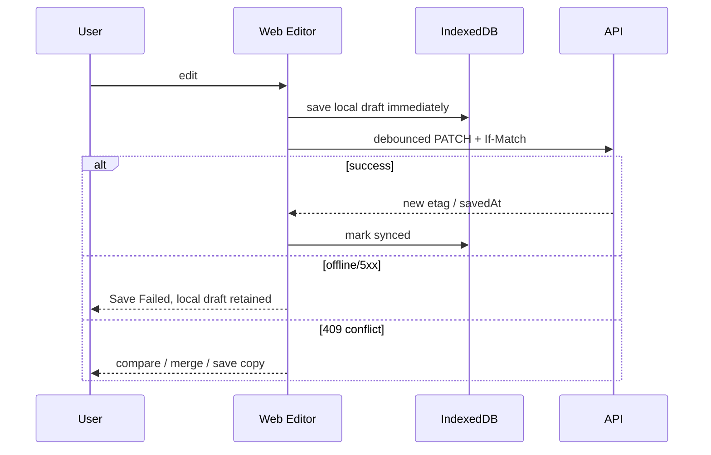

# `web` 应用技术设计

## 1. 定位

`apps/web` 是 Web ToC 主应用和移动 Web 适配层，负责 UI、编辑体验、本地草稿和实时状态呈现。它不是安全边界：所有权限、状态转换、Credits 和发布裁决必须由服务端完成。

| 项 | 设计 |
| --- | --- |
| Runtime | Browser；静态资源部署 CDN |
| 技术栈 | React 19、TypeScript、Vite、React Router、TanStack Query、Zustand（仅局部 UI） |
| UI | `@shiguang/ui` + design tokens；不直接复制 superagents 页面代码 |
| 编辑器 | CodeMirror 6、unified/remark/rehype、DOMPurify、Mermaid、KaTeX |
| 图表/表格 | ECharts、TanStack Table + Virtual |
| 实时 | SSE + query invalidation；AI 单次生成用 fetch streaming |
| 端口 | 本地 `3000` |

## 2. 页面域

```text
src/
├── app/                  # Router、providers、error boundaries
├── shell/                # 导航、Header、Command K、新建入口
├── features/
│   ├── home/
│   ├── assets/
│   ├── documents/
│   ├── html-assets/
│   ├── knowledge/
│   ├── research/
│   ├── tasks/
│   ├── datasets/
│   ├── presentations/
│   ├── templates/
│   ├── publishing/
│   ├── notifications/
│   ├── billing/
│   └── settings/
├── entities/             # Asset/Task/KB 等 UI model + query keys
├── shared/               # api client、SSE、draft store、i18n、a11y
└── workers/              # Markdown preview/search 等 Web Worker
```

feature 之间不得直接 import 内部组件；跨 feature 只通过 `entities` 和公开 barrel。Server state 只在 TanStack Query，Zustand 不复制 Asset/Task 权威数据。

## 3. UI 资料映射

72 张 UI 图展示了两套视觉方向（浅色资产工作区与深色任务/分析工作台）。实现时统一 token 体系并支持 light/dark，而不是为业务页面维护两套 DOM。关键交互：

- 首页：自然语言目标、Quick Create、运行中任务、最近内容；
- 全局新建：Document/HTML/KB/Research/Presentation/Upload + 最近模板；
- 编辑：Edit/Split/Preview/Source、AI 侧栏、保存状态；
- Research/Task：四步创建、可关闭页面、步骤级进度与输出；
- Dataset：概览、图表、质量、交互查询；
- Presentation：大纲确认、结构化编辑、Theme/Layout、播放；
- Publish：可见性、密码、有效期、短链、二维码、分析；
- Settings：MCP/API/Git/通知/Credits。

## 4. 数据获取

### 4.1 Query key

```text
['asset', workspaceId, assetId]
['asset-version', assetId, versionId]
['task', workspaceId, taskId]
['asset-list', workspaceId, stableFilterHash]
```

Mutation 成功只更新明确返回的实体并 invalidate 关联 key；禁止全局清空缓存。SSE 事件是 invalidation hint，收到后回读 REST 权威数据。

### 4.2 API client

- 从 OpenAPI 生成 type-safe client；
- 自动附加 `X-Request-ID` 和 `Idempotency-Key`；
- 409/412 转为领域冲突，不作为普通 toast；
- 401 交给统一登录回流，403 显示资源权限恢复动作；
- 429 展示 retry-after/额度，而不是无限自动重试。

## 5. 编辑与本地恢复



IndexedDB key 含 user subject + workspace + asset，退出登录必须清理或加密隔离。刷新时比较 server version、local base version 和 updatedAt，再决定恢复提示。

## 6. Markdown/HTML

- CodeMirror 维护源码；preview 放 Web Worker 解析，主线程只渲染受控 AST/HTML。
- HTML preview 不使用 `srcdoc` 在主域执行；先上传草稿快照或通过 user-content preview session 加载。
- Mermaid/KaTeX 使用固定版本和资源预算；错误在局部 block 展示。
- AI 选区操作生成 diff preview，用户 Apply 才修改编辑器 transaction。

## 7. Dataset 与 Presentation

- Dataset 只渲染服务端分页和聚合结果；大 CSV 不在浏览器全量 parse。
- 表格虚拟化，sort/filter 状态编码到 URL，Saved View 另存服务端。
- Presentation 编辑的是版本化结构化 JSON：slide/block/layout/theme，不开放任意 DOM/JS。
- 播放器与编辑器共享 renderer package，防止预览和发布表现漂移。

## 8. 可访问性和性能

- 键盘可完成主导航、Command K、编辑工具栏和演示播放；
- 焦点可见、Dialog trap、ARIA live 汇报保存/任务状态；
- 路由级 lazy loading；编辑器、ECharts、Presentation 按需加载；
- 长列表虚拟化；图片响应式、lazy、显式尺寸；
- 目标首屏 JS gzip < 250 KB（不含按需编辑器 chunk），INP/LCP 按真实数据监控。

## 9. 安全

- 不读写共享 session cookie；Cookie HttpOnly；
- 不持久化 identity assertion/API token；
- React 默认 escape，富内容必须 sanitizer；
- 链接统一处理 `rel=noopener noreferrer` 和 scheme allowlist；
- 不依赖隐藏按钮做授权；
- user-content postMessage 严格校验 origin/source/type。

## 10. 测试

- Unit：query reducer、draft merge、permission presentation、format parser；
- Component：各状态/错误/键盘/a11y；
- Contract：generated client 与 OpenAPI diff；
- E2E：document offline recover、version conflict、KB citation、task close/reopen、publish/revoke、HTML isolation；
- Visual：从 72 张 UI 图提取关键 viewport golden，但允许 token 统一后的受控差异。

## 11. 暂不实现

MVP 不做实时多人 CRDT、自由 Canvas、浏览器端大数据分析、复杂 Workflow Editor。UI 图中的评论/版本/团队协作若超出 PRD P0，保留信息架构入口但按阶段开关交付。

