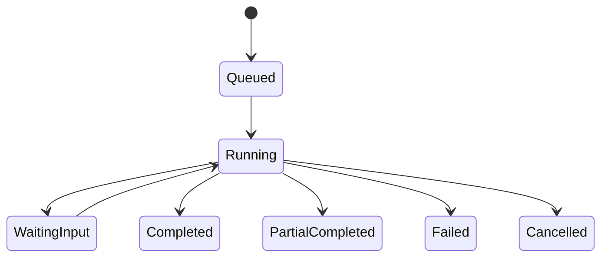

# `worker` 应用技术设计

## 1. 定位

`apps/worker` 是 Node.js 持久执行应用，合并原任务编排与 Agent Runtime。它注册 Hatchet
Workflow/Activity，负责后台副作用、Research/Expert Agent、工具循环、Evidence、通知、补偿和定时任务。
它不接收普通用户公网请求，不直接修改业务事实表。

| 项 | 设计 |
| --- | --- |
| Runtime | Node.js 22+、TypeScript |
| Orchestration | Hatchet TypeScript SDK |
| AI | 平台 model-gateway、结构化输出、tool registry |
| Events | NATS JetStream producer/consumer |
| Storage | Result/Checkpoint 仅保存对象引用 |
| Scaling | 同一镜像按 queue/profile 启动不同 deployment |

## 2. 为什么首期合并

Workflow 与 Agent 都是长任务执行面，共享任务上下文、重试语义、模型路由、Evidence、成本记录和结果投影协议。
首期独立应用会造成两套部署、Tracing、错误分类和 RPC。合并的是应用与镜像，不是代码边界：

```text
src/
├── bootstrap/
├── workflows/          # 状态机、等待、补偿、任务编排
├── activities/         # 通知、索引、发布、同步等确定性副作用
├── agents/             # planner、tool loop、evidence、checkpoint
├── tools/              # 工具注册、capability、预算和输出校验
├── projection/         # 回传 api 的 result commands
└── platform/           # Hatchet、NATS、Model Gateway、OTel
```

可以在同一镜像中以 `WORKER_PROFILE=workflow|agent|all` 注册不同 queue，因此能独立扩容 Agent pool，
而无需提前形成两个应用。

## 3. 职责边界

承担：

- Task/Step/Attempt 对应的 Hatchet Workflow；
- Research、Knowledge indexing、Presentation、Export、GC 等流程；
- Agent planner/tool/evidence/checkpoint 循环；
- Provider 调用记录、usage/cost proposal；
- 通知投递、同步、定时发布、失败补偿；
- 版本化 result command 与进度事件。

不承担：

- Asset、积分、Publish 等最终业务落库；
- 文件解析和 DuckDB 查询；
- 用户 HTTP、MCP 或公开页面流量；
- Provider secret 持久化；
- 自研 workflow 状态数据库。

## 4. Workflow 规则

每个 Workflow 定义稳定业务 key、输入/输出 schema、step retry、timeout、cancel boundary、compensation
和 version。等待用户确认必须使用 durable wait，不以进程内 Promise、轮询线程或浏览器连接保持状态。



Task 产品状态由 `api` projector 维护；Hatchet 状态只作为执行事实，不能直接暴露给 Web。

## 5. Agent 执行

1. API 创建 Task 和 Outbox；积分校验与扣费由外部积分系统负责；
2. Workflow 加载不可变 TaskSpec；
3. planner 生成有界计划；
4. 每个 Tool Call 先校验 capability、scope、预算和 schema；
5. Evidence 保存 source/version/locator/retrievedAt/contentHash；
6. 长流程周期性写 checkpoint object；
7. 输出先过 schema、citation、numeric consistency validator；
8. 仅将 artifact refs 投影回 API。

普通摘要、改写等单步 AI Function 可以作为 Activity 执行；只有多步检索、工具调用和动态规划任务进入
Agent loop。模型输出永远是 proposal，不是业务命令。

## 6. 幂等、重试与恢复

- Workflow key 使用 `taskId + workflowVersion`；
- Activity key 使用 `taskId + stepId + logicalItemId`；
- 副作用前查询 Inbox/业务唯一键；
- Provider 不支持幂等时持久化 provider request id；
- `Retry failed items` 只创建失败项的新 Attempt；
- Worker 被终止后从 Hatchet history 和最近 checkpoint 恢复；
- cancel 在安全点生效，已完成 artifact 保留并明确状态。

Transient network/provider 错误有限重试；权限、schema、预算耗尽和无效输入不重试。部分成功必须返回
successful refs 与 failed item errors，不能把整批伪装成成功。

## 7. Queue 与扩缩容

初始 queue：

- `workflow-control`：轻量编排、等待、投影；
- `agent-standard`、`agent-deep`：按模型并发与成本隔离；
- `notification`、`maintenance`：后台副作用；
- `index-orchestration`、`presentation`：领域流程。

同一镜像按 queue 启动不同 deployment。以 queue age、模型并发、失败率、token/cost 和 event-loop lag
扩容。控制 queue 保留最小副本，不能被高成本 Agent 饥饿。

## 8. 拆分触发条件

只有满足以下任一项才拆出 `agent-runtime`：

- Agent 与普通 Workflow 需要不同网络/凭据安全域；
- Agent 发布节奏或故障导致 Workflow SLO 无法达标；
- 通过 queue/profile 仍不能解决资源或依赖冲突；
- 已形成独立负责团队和稳定 result/tool contract。

## 9. 测试与 Eval

- Workflow replay/version、kill/retry/cancel/checkpoint；
- duplicate event/result、Outbox/Inbox 幂等；
- deterministic fake model 的 agent loop；
- tool schema、SSRF、size/time/capability limits；
- prompt injection、citation validity、numeric consistency；
- partial success、成本上限、fallback；
- Hatchet/NATS/Model Gateway 故障注入；
- Research golden set 与 provider/prompt regression。
