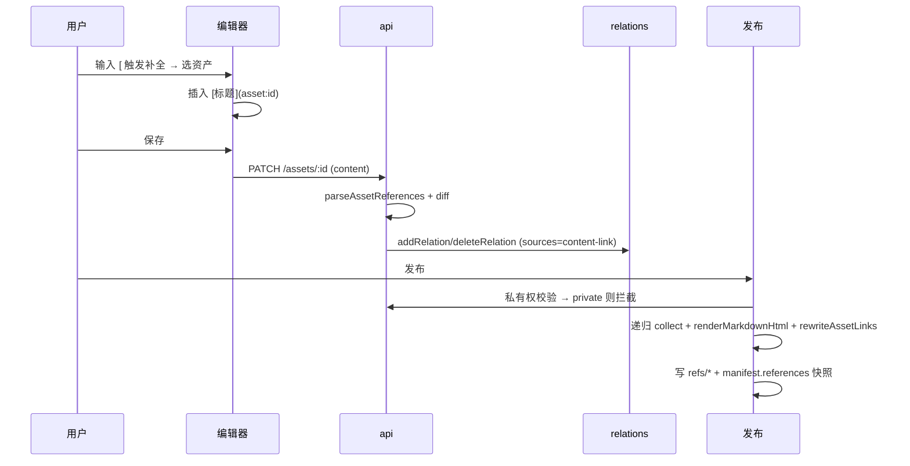

# 内部引用协议 —— 实现设计（第二步）

> 关联：[content-reference-gaps.md](./content-reference-gaps.md)、[content-reference-protocol.md](./content-reference-protocol.md)。
> 前置决策已拍板：D1 `asset:` 语法、D2 正文为事实源 + relations 自动投影、D3 默认快照、私有权「拦截提示」。
> 本文给出可落地的实现设计，分「共享基座 → 存储层 → 三个工作流」展开。

## 1. 范围与目标

打通一条链路：**编辑器插入 `asset:` 引用 → 保存时自动维护 relations 投影 → 阅读页可跳转 → 发布时校验私有/递归打包/重写链接**。

三条工作流：

1. **编辑器**：输入 `[`/`[[` 或点「插入引用/图片」→ 资产选择 → 插入 `[标题](asset:<id>)` / ``。
2. **保存同步**：`PATCH /api/v1/assets/:id` 保存正文时，解析 `asset:` 引用并 diff 出 relations 投影。
3. **发布**：发布前拦截 private 引用 → 递归收集依赖 → 重写链接 → 快照进 manifest。

## 2. 共享基座：引用解析与重写

新增 `packages/content/src/references.ts`，供 web（编辑器/阅读页）与 api（保存同步/发布）共用。

### 2.1 `parseAssetReferences(markdown): Reference[]`

```ts
interface AssetReference {
  assetId: string;
  kind: "link" | "image";   // link = [文本](...), image = 
  label: string;            // 链接文本或图片 alt
}

function parseAssetReferences(markdown: string): AssetReference[];
```

实现要点：单个正则同时匹配链接与图片的 `](asset:<id>)`，再回看前一个字符是否为 `!` 判定 kind：

```ts
const re = /(!)?\[([^\]]*)\]\(asset:([A-Za-z0-9_-]+)\)/g;
```

`assetId` 复用 `assetIdSchema` 的格式（当前为 `[A-Za-z0-9_-]+` 风格，需与 `contracts` 对齐）。

### 2.2 `rewriteAssetLinks(html, resolver): string`

对已渲染 HTML（含 `href="asset:<id>"` / `src="asset:<id>"`）做后处理：

```ts
type Resolver = (ref: { assetId: string; kind: "link" | "image" }) => string | null;

function rewriteAssetLinks(html: string, resolver: Resolver): string;
```

- 应用内 resolver：把 `asset:<id>` 映射为内部路由（`/documents/<id>` 等）。
- 发布 resolver：把 `asset:<id>` 映射为 bundle 相对路径（`refs/<id>/index.html` 等）。
- 返回 `null` 表示无法解析（保留原样或降级为纯文本标题）。

### 2.3 关键坑：`rehype-sanitize` 会剥掉 `asset:` 协议

`apps/web/src/shared/markdown.tsx` 用了 `rehypeSanitize`，其默认 schema 只允许 `http/https/mailto` 等安全协议，**会把 `asset:` 的 href/src 剥掉**。必须在 `rehypeSanitize` 的 schema 中把 `asset` 加入 `a[href]` 与 `img[src]` 的 `protocols`，否则应用内预览里 `asset:` 链接渲染出来没有 href。

> 发布侧 `renderMarkdownHtml` 走 `marked`（不 sanitize），会原样输出 `asset:`，只需 `rewriteAssetLinks` 后处理，无此坑。

## 3. 存储层改造（`packages/database/src/store.ts`）

现状（`store.ts:890-952`）：`addRelation` 遇重直接返回旧行、**不合并 provenance**；没有 `deleteRelation`；`asset_relations` 有 `UNIQUE(source_asset_id, target_asset_id, relation_type)`（`0001_init.sql:104-112`）。

### 3.1 `addRelation` 合并 provenance

- 把 `provenance.sources` 定为 `string[]`，`addRelation` 在关系已存在时做 union 后回写，避免「附件 + 正文引用同一文件」时丢失来源标记。

### 3.2 新增 `deleteRelation`

```ts
async deleteRelation(sourceAssetId: string, targetAssetId: string, relationType: RelationType): Promise<void>
```

供「保存同步」在正文删除引用时清理投影。

### 3.3 provenance 约定 + 历史回填

| 来源 | `provenance.sources` | 建立者 |
| --- | --- | --- |
| 附件 | `["attachment"]` | 编辑器附件上传（`POST /assets/:id/relations`） |
| 正文引用 | `["content-link"]` | 保存同步 |
| 历史遗留 `{}` | 视为 `["attachment"]` | 迁移回填或读取时归一化 |

> 之所以必须区分：正文删掉某条 `asset:` 引用时，只能删除「纯 content-link」的投影，不能误删同名附件关系。

## 4. 工作流一：编辑器（`apps/web`）

### 4.1 插入引用 / 自动补全

- CodeMirror markdown 语言加 `autocompletion` source：触发 `[` 或 `[[` 时，调 `api("/search", { params: { q } })`（已有，`assets.ts:396`）列出资产，选中后插入 `[标题](asset:<id>)`。
- 工具栏加「插入引用」按钮 → 打开资产选择 Modal（复用搜索）→ 插入。
- 兼容 Obsidian 习惯：输入 `[[` 也走同一补全，但**落盘统一为 `[标题](asset:<id>)`**（不在存储里保留 `[[...]]`）。

### 4.2 插入图片

工具栏「插入图片」→ 资产选择器限定 `file`/图片类型 → 插入 ``。

### 4.3 阅读页 / 编辑器预览渲染

- `shared/markdown.tsx`：
  1. `rehypeSanitize` 放开 `asset:` 协议（见 2.3）。
  2. 增加可选 `resolveAssetLink?: Resolver`（或内置 hook 批量查类型），渲染后用 `rewriteAssetLinks` 把 `asset:` 映射为 `/documents/<id>`、`/datasets/<id>`、`/presentations/<id>`、`/assets/<id>`（复用 `asset-detail.tsx:407-414` 的类型→路由映射）。

## 5. 工作流二：保存时关系同步（`apps/api`）

### 5.1 `PATCH /api/v1/assets/:id`（`assets.ts:232-269`）内新增 diff

当 `body.content` 存在且 `asset.type ∈ {document, report}` 时，在 `saveContent` 之后（或同一事务内）：

1. `refs = parseAssetReferences(content.text)` → 目标 id 集合 `S`。
2. `existing = listRelations(id)` 过滤 `relationType === "references"` 且 `direction === "out"` 且 `provenance.sources` 不含 `"attachment"`（即纯 content-link）。
3. 对 `S` 中每个目标：`addRelation(id, target, "references", { sources: ["content-link"] })`（会合并）。
4. 对 `existing` 中 `target ∉ S` 的：`deleteRelation(id, target, "references")`。

> 边界：正文引用指向一个已删除/无权限的资产时，保存不报错、不建关系（`addRelation` 目标存在性由后续发布校验兜底）。

### 5.2 附件上传补 provenance

`POST /api/v1/assets/:id/relations`（`assets.ts:370-394`）与编辑器 `handleAttachment` 走到的路径，把 `addRelation(..., {})` 改为 `{ sources: ["attachment"] }`。历史 `{}` 行在读取时归一化为 `["attachment"]`。

## 6. 工作流三：发布依赖图 + 链接重写 + 私有权拦截（`apps/api`）

改造 `apps/api/src/modules/publishing.ts` 的 `buildAndAttachRelease`（`publishing.ts:226-359`），`POST /publishes` 与 `POST /publishes/:id/release` 都经过它，天然覆盖「新建 + 重新发布」。

### 6.1 发布前私有权校验（拦截）

在构建 release 前：

1. 解析主资产正文 `asset:` 引用 → 目标集合。
2. 批量读目标资产；若任一 `visibility === "private"` 或 `deletedAt` 非空 → `throw badRequest("REFERENCE_PRIVATE", "以下被引用资产为私有，无法发布：<标题列表>")`，**不降级、不打包**。

> 校验只针对「将被快照进 bundle」的引用；指向已发布公开资产的「实时链接」为 P1，不在本轮。

### 6.2 依赖图构建（递归、防环）

```
collect(assetId, visited):
  if assetId in visited: return
  visited.add(assetId)
  refs = parseAssetReferences(content.text)
  for r in refs:
    目标 = getAsset(r.assetId)
    if 目标是 document/report: 递归 collect → 渲染 refs/<id>/index.html
    if 目标是 file/图片: 下载 blob → refs/<id>/<fileName>
```

- 复用现有 `listRelations` 不需要——**依赖来源是正文解析结果**（D2 事实源是正文），relations 只用于关系视图/权限，不用于打包收集。
- 快照 path 规则：文档 `refs/<assetId>/index.html`；file `refs/<assetId>/<safeFileName>`。

### 6.3 链接重写 + manifest 快照

1. 主资产 `renderMarkdownHtml` 后，用 `rewriteAssetLinks`（发布 resolver）把 `href="asset:<id>"` → `href="refs/<id>/index.html"`、`src="asset:<id>"` → `src="refs/<id>/<fileName>"`。
2. 嵌套被引用文档也各自 `renderMarkdownHtml` + 同样重写（递归里做）。
3. `buildReleaseBundle` 的 manifest（`render.ts:182-193`）增加 `references` 快照：

```ts
references: Array<{ assetId: string; versionId: string; path: string; kind: "link" | "image" }>
```

用于追溯与「引用更新后重新发布」提示。

### 6.4 CSP

bundle 内资源同源，现有 `img-src 'self' data: https:`（`render.ts:192`）已覆盖 `refs/*` 图片；跨 `refs/*.html` 导航是同源跳转，无需改动。保持 `connect-src 'self'`（不放开）。

## 7. 端到端时序



## 8. 改动文件清单

| 文件 | 改动 |
| --- | --- |
| `packages/content/src/references.ts`（新） | `parseAssetReferences` / `rewriteAssetLinks` |
| `packages/content/src/index.ts` | 导出新模块 |
| `packages/database/src/store.ts` | `addRelation` 合并 provenance、新增 `deleteRelation` |
| `packages/database/migrations/0002_*.sql`（新） | 可选：`provenance_json` 历史 `{}` → `{"sources":["attachment"]}` 回填 |
| `packages/contracts/src/index.ts` | 如需：引用解析结果的轻量类型/常量（`asset:` 前缀） |
| `apps/api/src/modules/assets.ts` | 附件 provenance、`PATCH` 保存同步 |
| `apps/api/src/modules/publishing.ts` | 私有拦截、依赖图、重写、manifest 快照 |
| `apps/api/src/platform/render.ts` | manifest 增加 `references`；暴露 markdown→html 复用入口 |
| `apps/web/src/shared/markdown.tsx` | sanitize 放开 `asset:`、`resolveAssetLink` + 重写 |
| `apps/web/src/features/documents/editor.tsx` | 补全、插入引用/图片动作 |

## 9. 分阶段实施顺序（建议）

1. **基座 + 存储**（`references.ts`、store 三处）：纯函数与 DB 方法，可单测。
2. **保存同步**（assets.ts）：链路最短、可独立验证（改正文 → relations 自动变化）。
3. **编辑器 + 阅读页**（markdown.tsx、editor.tsx）：用户体验闭环。
4. **发布**（publishing.ts、render.ts）：私有拦截 → 依赖图 → 重写 → 快照。

每阶段均可独立上生产，不互相阻塞。

## 10. 验收要点

- 插入引用后，`GET /assets/:id/relations` 出现 `references` 且 `provenance.sources` 含 `content-link`；删掉正文该引用后关系同步消失。
- 附件与正文引用同一文件时，两处来源并存；删正文引用不删附件关系。
- 阅读页 `asset:` 链接可跳到正确路由（不丢 href）。
- 发布含 private 引用时返回 `REFERENCE_PRIVATE` 且不产出 release。
- 发布产物：主文档内 `asset:` 全部重写为 `refs/...`；manifest.references 快照齐全；离线打开被引用文档/图片可读。
