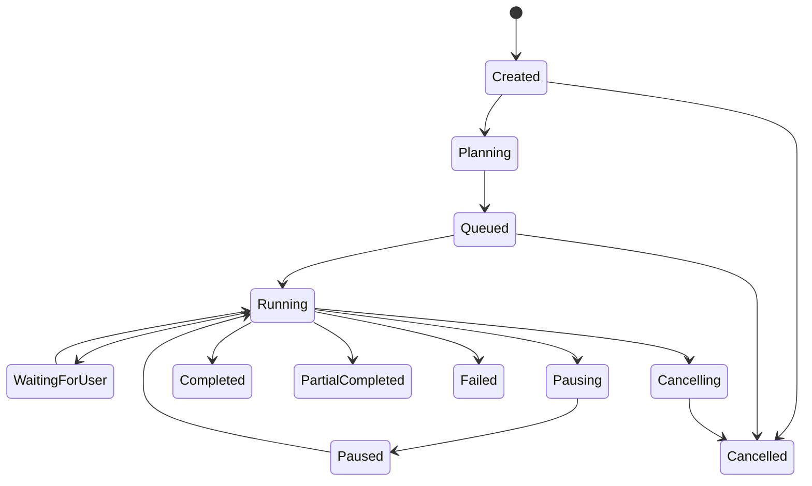

# API、任务与领域事件契约

## 1. 契约层次

| 层次 | 格式 | 维护位置 | 兼容规则 |
| --- | --- | --- | --- |
| Browser/Public API | OpenAPI 3.1 JSON/REST | `packages/contracts/openapi` | URL major version；字段只增不改 |
| Internal RPC | ConnectRPC/Protobuf | `packages/contracts/proto` | protobuf field number 永不复用 |
| Domain Event | JSON Schema + Zod | `packages/contracts/events` | `eventType` + `schemaVersion` |
| Hatchet input/result | Zod/JSON Schema | `packages/contracts/workflows` | Workflow name 带 major version |
| MCP tool | MCP JSON Schema | `api/integrations` + contracts | tool name 稳定；新增 optional fields |

Node 与 Go 契约通过生成代码共享，不让 Go 解析 TypeScript 类型，也不让 Node 复制 Go struct。

## 2. HTTP 约定

### 2.1 通用 Header

| Header | 用途 |
| --- | --- |
| `X-Request-ID` | 端到端请求标识；网关生成或校验 |
| `traceparent` | W3C Trace Context |
| `Idempotency-Key` | 创建任务、发布、Credit 操作等可重试命令 |
| `If-Match` | Asset/Document 乐观锁，值为 version/etag |
| `Last-Event-ID` | SSE 断点续传 |

### 2.2 错误模型

```json
{
  "type": "https://docs.shiguanglab.com/problems/version-conflict",
  "title": "Version conflict",
  "status": 409,
  "code": "ASSET_VERSION_CONFLICT",
  "detail": "The document changed after this draft was opened.",
  "instance": "/api/v1/assets/ast_123",
  "requestId": "req_...",
  "recoveries": ["reload", "save_as_copy", "compare"]
}
```

采用 RFC 9457 Problem Details 风格。错误必须说明对象、阶段和可恢复动作，不向外暴露堆栈、SQL、Provider 响应正文。

### 2.3 分页

- 主列表使用 cursor pagination，cursor 为签名 opaque token。
- Dataset 行查询使用 `offset/limit` 仅作用于不可变 version 和确定性 sort。
- 默认/最大 page size 由 endpoint 定义；禁止不分页的集合 API。

## 3. 领域事件信封

```json
{
  "eventId": "evt_01...",
  "eventType": "asset.version.created",
  "schemaVersion": 1,
  "occurredAt": "2026-08-13T12:00:00.000Z",
  "producer": "api",
  "tenantId": "ten_...",
  "aggregate": {
    "type": "asset",
    "id": "ast_...",
    "version": 7
  },
  "trace": {
    "traceparent": "00-..."
  },
  "data": {
    "assetType": "document",
    "versionId": "av_..."
  }
}
```

规则：

- `tenantId` 是数据隔离字段，消息系统 credential 仍需限制 subject。
- PII 不进入 envelope；Actor 只传内部 ID 或不可逆 hash。
- 大对象使用 `BlobRef`：`objectKey/contentHash/mediaType/size`。
- 消费者按 `eventId` Inbox 去重，并拒绝未知 major schema。
- 同 aggregate 版本小于等于当前值时幂等跳过；出现版本缺口时重建读模型。

## 4. 核心事件

| Event | Producer | Consumers | 关键数据 |
| --- | --- | --- | --- |
| `asset.created` | api/assets | search, activity | assetId/type |
| `asset.version.created` | api/assets | index workflow, presentation stale detector | versionId/contentRef |
| `asset.deleted/restored` | api/assets | search, publishing, GC | deletedAt/retentionUntil |
| `knowledge.source.added` | api/knowledge | worker | sourceId/versionRef |
| `knowledge.source.ready/failed` | api projector | notification, UI | sourceId/indexVersion/errorCode |
| `task.progressed` | workers | task projector, realtime | monotonic sequence/progress/step |
| `task.completed/partial/failed` | api projector | notification, billing | outputs/cost/error summary |
| `publish.released/revoked` | api/publishing | public cache purge | releaseId/slug/etag |
| `credit.reserved/settled/released` | api/billing | usage projection | ledgerEntryId/amount |

## 5. Task 状态与命令

产品状态是权威读模型，Hatchet 状态是执行引擎状态，两者不能混为一列：



每个 command 必须包含：`commandId`、`taskId`、`expectedTaskVersion`、`actor`、`reason`。取消是协作式：停止派发新活动，正在运行的外部请求使用 AbortSignal/context cancellation；不可中断步骤完成后不再推进。

## 6. Result Projection

Worker 结果示例：

```json
{
  "resultSchema": "research-result/v1",
  "taskId": "tsk_...",
  "runId": "run_...",
  "attempt": 2,
  "outputs": [
    {
      "kind": "report-draft",
      "blob": {
        "objectKey": "task-artifacts/.../report.json",
        "contentHash": "sha256:...",
        "mediaType": "application/json",
        "size": 238410
      }
    }
  ],
  "usage": { "inputTokens": 0, "outputTokens": 0, "providerCostMicros": 0 },
  "failures": []
}
```

`api` projector 验证 task/run/attempt、hash 和 schema 后，在一个事务内：

1. 插入 `projection_inbox`；
2. 创建 Asset/Version/Relation；
3. 更新 Task/Step 读模型；
4. 结算 Credit ledger；
5. 写 Outbox；
6. 提交后再发布完成事件。

## 7. SSE 协议

SSE 仅用于 invalidation 和小型状态快照：

```text
id: 184922
event: task.updated
data: {"taskId":"tsk_...","sequence":37,"status":"running","progress":63}
```

- 每用户/租户通道在 API 做权限过滤；
- 发送 heartbeat，断线指数退避；
- 客户端收到事件后按需回读权威 REST 资源；
- 不通过 SSE 传模型完整 token 流或 Asset 全文；AI 编辑流使用单请求 fetch streaming。

## 8. MCP 工具 v1

Read-only 默认工具：

- `search_assets(query, types?, scope?, cursor?)`
- `read_asset(asset_id, version_id?, format?)`
- `search_knowledge(knowledge_base_id, query, limit?)`

P1 Write 工具：

- `create_asset`
- `update_asset`（必须带 expected version）
- `create_task`
- `publish_asset`（高风险 capability + 显式 token scope）

工具只调用 `api` application service；响应含稳定 resource URI 和 citation metadata，不泄露对象存储内部 key。
