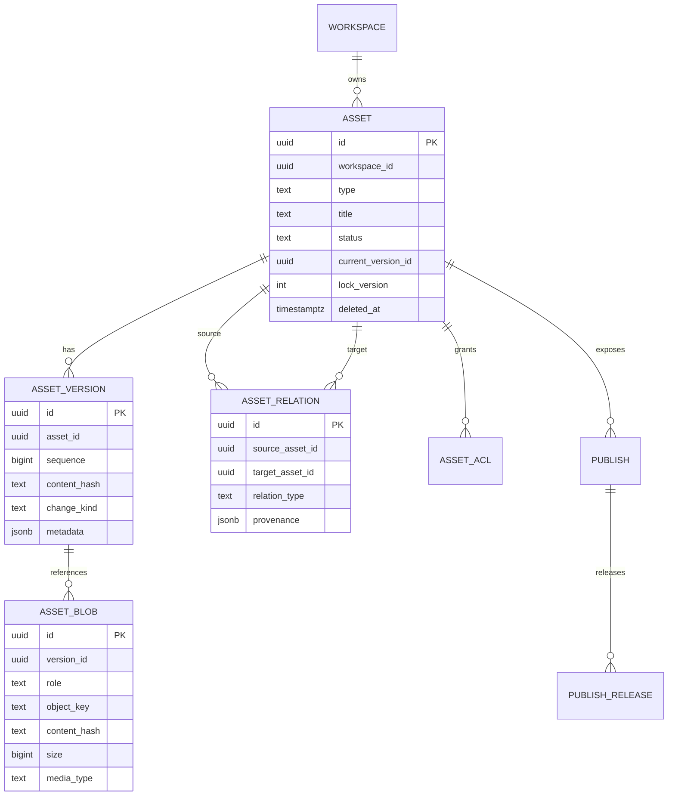
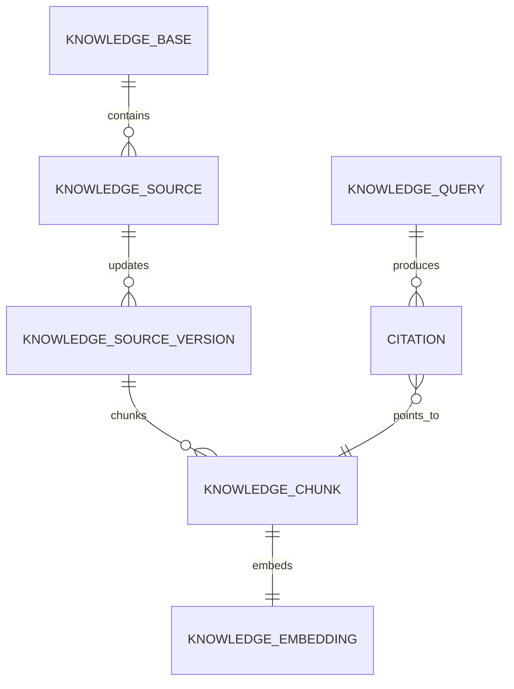

# 数据架构设计

## 1. 数据分层

| 层 | 介质 | 内容 | 一致性 |
| --- | --- | --- | --- |
| Transaction | PostgreSQL | 业务事实、权限、账本、幂等、Outbox | 强一致 |
| Object | SeaweedFS/S3 | 原始文件、版本正文、派生物、Parquet、发布包 | 引用后不可变 |
| Search | PostgreSQL FTS + pgvector | 可重建 chunk、全文索引、embedding | 最终一致 |
| Workflow | Hatchet database | 执行历史、重试、调度 | 引擎权威 |
| Event | NATS JetStream | 领域事实传输、进度、通知 | 至少一次 |
| Analytics | PG partitions / Umami | 产品事件、公开访问数据 | 最终一致 |

## 2. Asset 聚合

Asset 保存稳定身份，AssetVersion 保存不可变内容。恢复历史版本会创建新版本，绝不覆盖旧记录。



### 2.1 类型化扩展表

`assets` 不塞入所有类型字段。每种 Asset 有一张 1:1 或 1:N 扩展表：

- `document_versions`：format、frontmatter、render profile；
- `html_versions`：entrypoint、CSP policy、network allowlist、scan result；
- `dataset_versions`：schema、row count、Parquet ref、profile stats；
- `presentation_versions`：slide document ref、theme/layout versions；
- `report_versions`：outline/evidence coverage；
- `source_versions`：canonical URL、fetchedAt、publisher、license metadata。

## 3. Workspace 与权限数据

ToC 用户也映射为 personal workspace，所有业务表都带 `workspace_id`，避免 P1 团队化时大规模回填。

核心表：

- `workspaces(id, type, external_org_id, owner_subject, status)`；
- `workspace_members(workspace_id, subject, role)`；
- `asset_acl(asset_id, principal_type, principal_id, role)`；
- `api_tokens(id, workspace_id, secret_hash, scopes, expires_at, revoked_at)`；
- `audit_events(id, workspace_id, actor, action, resource, outcome, metadata)`。

查询必须先应用 workspace/ACL predicate。P1 可增加 PostgreSQL RLS 作为纵深防御，但应用层授权仍是主逻辑。

## 4. 文档、草稿与版本

### 4.1 自动保存

- 客户端 IndexedDB 保存 local draft：`assetId/baseVersion/content/updatedAt`。
- 用户输入 500–1000 ms debounce 后提交 `PATCH`，携带 `If-Match`。
- 服务端保存 mutable draft snapshot；满足时间、显式保存、发布、AI apply、离开编辑等条件时形成不可变 AssetVersion。
- 409 冲突返回 current version 和 compare token；客户端提供 reload、merge、save copy。

MVP 不实现实时多人 CRDT。P1 明确需要实时协作后再引入 Yjs/Hocuspocus，不能把评论 UI 误判为实时共编需求。

### 4.2 AI 修改

AI 输出创建 `proposed_patch`，记录 base version、selection range、model run 和 diff。只有用户 Apply 后才进入 draft；base version 已变化则重新定位或要求人工合并，禁止静默覆盖。

## 5. 知识库模型



关键字段：

- source version 绑定精确 AssetVersion/URL fetch/blob hash；
- chunk 保存 `ordinal`, `heading_path`, `page`, `char_start/end`, `text_hash`；
- embedding 保存 `model_profile`, `dimensions`, `vector`, `content_hash`；
- citation 保存 answer span → chunk → source locator，点击必须可回到原版本。

### 5.1 索引幂等

幂等键为 `kb_id + source_version_id + parser_version + chunker_version + embedding_profile`。同 key 已 Ready 时直接复用；失败可从 parsing/chunking/embedding/upsert 某阶段重试。

### 5.2 混合检索

1. ACL/workspace/source status 过滤；
2. FTS/`pg_trgm` 召回 top 100；
3. pgvector 召回 top 100；
4. RRF 合并 top 30；
5. 可选 reranker top 10；
6. Answer 只使用选中 chunk，输出 citation；
7. Evidence 不足时返回不足，不允许模型补造来源。

## 6. Research 与 Evidence

核心表：

- `research_specs`：goal、scope、region、time range、depth、quality、output selection；
- `task_runs/task_steps/task_attempts`：产品读模型，不替代 Hatchet history；
- `evidence_items`：claim、source asset/version、locator、excerpt hash、retrievedAt、confidence、verification status；
- `task_outputs`：task → asset/version relation；
- `model_usage`：step、provider profile、tokens、provider cost、credit units。

原始网页快照需遵守 robots/授权和内容合规策略；默认存元数据与必要引用，不永久复制无权保存的完整正文。

## 7. Dataset 数据模型

### 7.1 元数据

```text
datasets
dataset_versions
dataset_columns
dataset_profiles
dataset_quality_issues
dataset_saved_views
chart_specs
```

每个 DatasetVersion 对应不可变 Parquet。Schema 变化创建新版本。字段 ID 与显示名分离，重命名不破坏 Chart/Saved View 引用。

### 7.2 查询计划

API 接收结构化请求：

```json
{
  "datasetVersionId": "dsv_...",
  "select": ["company", "revenue"],
  "filters": [{ "column": "year", "op": "gte", "value": 2024 }],
  "sort": [{ "column": "revenue", "direction": "desc" }],
  "limit": 100,
  "offset": 0
}
```

`compute-worker` 的 data 模块用 allowlist AST 编译参数化 DuckDB SQL，并施加：最大 200 列、1,000 返回行、扫描字节、10 秒 wall time、每 workspace 并发、临时目录 quota。AI 只能生成同一 AST，不能执行任意 SQL。

## 8. Publish 模型

- `publishes`：稳定 slug、visibility、password hash、expiresAt、allowDownload/copy；
- `publish_releases`：不可变 release，绑定精确 AssetVersion 和静态 bundle；
- `short_links`：slug → publish，支持撤销；
- `publish_access_events`：按日分区的低敏访问事件；
- `publish_daily_stats`：异步聚合读模型。

内容更新后创建新 Release，再原子切换 `active_release_id`；缓存键包含 release id/etag，旧 release 延迟清理，发布切换可回滚。

## 9. Credits 账本

Credits 必须用 append-only ledger，不在用户表直接做 `balance = balance - x`：

- `credit_accounts`；
- `credit_ledger_entries`：grant/reserve/settle/release/refund/expire；
- `credit_reservations`：绑定 task，带过期时间；
- `usage_records`：模型、存储、任务维度的原始计量。

启动高成本任务时 reserve 上限；运行中分步记录 provider usage；结束后 settle 实际值并 release 余额。所有操作以 `operation_id` 唯一，防止重试重复扣费。

## 10. 生命周期与备份

- PostgreSQL：每日全量 + 连续 WAL/PITR；季度恢复演练。
- SeaweedFS：对象 version/replication 与异地备份；数据库备份必须与 object manifest 对账。
- Asset soft delete 保留 30 天；legal hold/P1 可覆盖。
- GC 扫描只删除“超过保留期且无任何版本/发布/任务引用”的 blob。
- 搜索索引、daily stats 和缩略图均视为可重建数据，不作为唯一备份。
