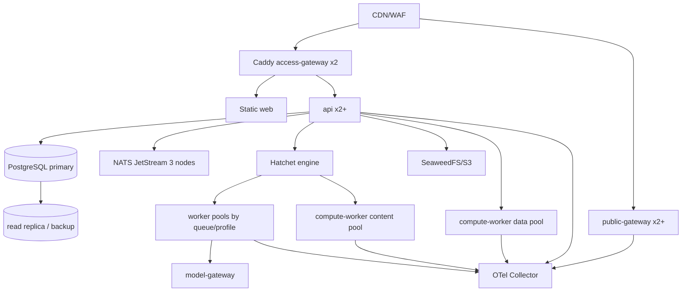

# 部署、可靠性与运维设计

## 1. 环境拓扑

### 1.1 本地开发

Docker Compose profiles：

- `core`：PostgreSQL + pgvector、NATS JetStream、Hatchet、SeaweedFS；
- `app`：web、api、worker、compute-worker、public-gateway；
- `observability`：OTel Collector、Prometheus、Grafana、Loki、Tempo；
- `platform-byo`：不启动 Auth/Access/Model Gateway，指向已有环境。

前端和 Node 应用可在宿主机运行；基础设施固定镜像版本和健康检查。

### 1.2 生产



MVP 若使用单节点基础设施，必须记录其单点风险并保证可恢复备份；不能在文档中把单机 Compose 描述成 HA。

## 2. 应用扩缩容

| 应用 | 扩容指标 | 特殊约束 |
| --- | --- | --- |
| web | CDN 命中率/带宽 | 静态不可变 hash asset |
| api | CPU、RPS、DB pool wait | 无状态；总连接数受 PG 限制 |
| worker | Hatchet queue age、模型并发、成本 | 同镜像按 workflow/agent queue profile 分池 |
| compute-worker | queue age、Query P95、CPU/内存、cache hit | 同镜像按 content/data profile 分池和配额 |
| public-gateway | RPS、带宽、CDN miss | 尽量无状态，密码 session 可签名 |

## 3. 可靠性模式

### 3.1 Idempotency

- HTTP command 使用 `Idempotency-Key + actor + route` 唯一索引；
- Workflow/Activity 使用业务 key，不使用随机 attempt 作为业务身份；
- Event consumer 使用 Inbox；
- Asset version、publish release、credit ledger 具有业务唯一约束；
- 外部 API 不保证幂等时保存 provider request id 和 result。

### 3.2 Timeout/Retry

- 所有网络调用有 connect、request、idle timeout；
- 只对安全错误重试，指数退避 + jitter + 最大 attempt；
- 4xx、schema invalid、permission denied 不重试；
- 模型超时可降级 quality/profile，但必须记录路由变化；
- Circuit breaker 用于 Model Gateway、外部 Search、S3；数据库不做盲目应用层重试事务。

### 3.3 Partial Success

批任务以 item/step 记录成功和失败。Workflow 汇总时输出 successful refs + failed item errors，Task 状态为 `partial_completed`；重试只创建失败 item 的新 attempt，不重算成功项。

### 3.4 Backpressure

- 上传通过 signed URL，不经 API 转发大字节；
- 每 workspace 设置 active Research/Agent、索引、导出并发；
- Hatchet queue 做 rate/concurrency limit；
- NATS consumer 使用 pull + bounded batch；
- SSE 慢客户端丢弃中间 invalidation，只保留最新快照提示。

## 4. 降级策略

| 故障 | 用户行为 |
| --- | --- |
| Model Gateway 不可用 | 文档/浏览/发布仍可用；AI 操作明确失败并可重试 |
| Hatchet 不可用 | 不接受新后台任务或标记 queued；已有数据读取不受影响 |
| NATS 不可用 | Outbox 累积；基础写入成功，实时通知延迟 |
| SeaweedFS 不可用 | 元数据可读；正文/文件访问返回可恢复错误；禁止形成无 blob 的版本 |
| compute-worker data profile 不可用 | Dataset 元数据可读，交互查询降级；不影响其他 Asset |
| Auth/Redis 不可用 | 受保护路由 fail closed 503；公开发布继续可用 |
| pgvector 索引异常 | 可临时 exact/keyword search 或标记检索降级 |

## 5. 数据库发布

采用 expand/contract：

1. 备份并验证 migration；
2. 先执行向后兼容 schema expansion；
3. 部署同时兼容新旧字段的应用；
4. backfill 可暂停、可重试；
5. 切读路径并观察；
6. 下一发布再删除旧字段。

Migration 是单独发布步骤，不在应用多副本启动时自动抢跑。所有 destructive migration 需数据量估算和 rollback/roll-forward 方案。

## 6. SLO 与告警

首期 SLI：

- API availability/latency/error rate；
- Task start delay、completion/partial/failure rate；
- Source indexing latency/failure；
- publish availability/TTFB；
- object store error/latency；
- DB connection saturation/replication lag；
- NATS consumer lag/redelivery；
- Hatchet queue age；
- model cost and token anomaly；
- citation coverage/invalid citation rate。

告警以用户影响为中心；单次 Tool Call 失败不直接 page，任务失败率、队列积压和错误预算消耗才 page。

## 7. 备份与灾备

| 数据 | 备份 | 恢复验证 |
| --- | --- | --- |
| PostgreSQL | daily base backup + WAL/PITR | 每季度恢复到隔离环境并跑一致性检查 |
| SeaweedFS | replica + 异地 bucket mirror/snapshot | 抽样 hash 校验和 manifest 对账 |
| Hatchet DB | 与业务库分开备份 | 恢复后验证在途 workflow 行为 |
| NATS | file storage replica；事件非唯一事实 | 从 Outbox/DB 重放关键读模型 |
| secrets | Secret manager/versioned key backup | 年度轮换和恢复演练 |

恢复优先级：Auth/Edge → PostgreSQL → S3 → API/Public → Hatchet/Worker/Compute → NATS projections → analytics。

## 8. CI/CD

```text
format/lint
  -> unit/property tests
  -> contract generation diff
  -> Go/Node build
  -> container + SBOM + vulnerability scan
  -> integration (PG/NATS/Hatchet/S3)
  -> migration dry-run
  -> deploy canary
  -> smoke + SLO observation
  -> progressive rollout
```

Monorepo 用 Turborepo affected graph 只构建受影响应用；共享 contracts/database 变化触发所有消费者。镜像以 git SHA 标记，部署清单记录 schema version、workflow version 和 contract version。
