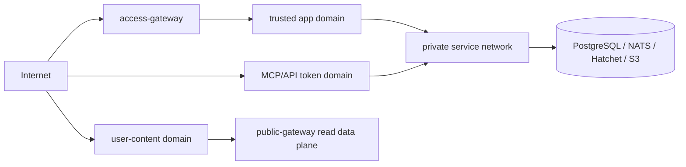

# 安全与权限架构

## 1. 信任域

硬边界：用户自定义 HTML 绝不能与登录主站同 origin、同 registrable domain 或共享 Cookie。

## 2. 身份链路

1. Access Gateway 删除外部传入的 `X-SG-*`/`X-User-*`。
2. Auth Service 校验 opaque session，签发短时 `X-SG-Identity`。
3. API 从 JWKS 校验 RS256、issuer、audience、expiry、jti 和 entitlement。
4. API 映射 subject/org 到 workspace membership。
5. 每个 repository 查询显式接收 `ActorContext`，不能从全局变量隐式获得租户。

服务间调用使用独立 workload credential/mTLS；用户 assertion 不直接作为数据库或 NATS credential。

## 3. 授权模型

角色：

- Workspace：Owner、Admin、Member、Guest；
- Asset：Owner、Editor、Viewer；
- Knowledge Base：Manage、AddSource、Ask、Read；
- Task：Owner、Collaborator、Viewer；
- Token：Scope + action (`read`, `write`, `task:create`, `publish`)；
- Publish：Private、Unlisted、Public、Password、MemberOnly。

授权顺序：租户 → 资源状态 → membership → ACL → action policy → 高风险二次确认。默认拒绝。公开发布是显式 release，不改变原 Asset 的私有 ACL。

## 4. HTML 与 Presentation 安全

### 4.1 编辑预览

- iframe 使用独立 user-content origin；
- `sandbox` 默认不含 `allow-same-origin`、`allow-top-navigation`、`allow-popups`；
- 只在确有需求时允许 `allow-scripts`；
- 每个 Asset 生成 CSP：`default-src 'none'`，资源/网络按 allowlist 开启；
- 主站通过校验 origin/source 的 `postMessage` 发送尺寸、错误等有限消息；
- iframe 设置 load/runtime watchdog，失控时销毁 iframe。

浏览器不能可靠硬限制单 iframe 的 CPU/内存。PRD 中“CPU/内存限制”应实现为：独立进程/origin、资源数量和体积限制、网络 CSP、超时销毁；服务端截图/预渲染则必须放入无网络或 allowlist 网络的 container，并配置 cgroup/seccomp/time limit。

### 4.2 发布

- 静态 bundle 经过 HTML parser 检查、恶意协议移除和 antivirus scan；
- 公共网关不返回主域 Cookie，也不接受主域身份 header；
- 发布域设置 `Cross-Origin-Opener-Policy`、`Cross-Origin-Resource-Policy`、`X-Content-Type-Options`、严格 CSP；
- 上传文件一律 `Content-Disposition: attachment`，只有白名单 media type 可 inline；
- 公开 release 不暴露内部 S3 key，使用稳定 public route。

## 5. 上传安全

1. API 创建 multipart upload session 和限定 object key；
2. Browser 直传 S3 signed URL；
3. complete 时校验 size、part、hash；
4. 对象进入 quarantine；
5. compute-worker content profile 做 MIME sniff、压缩炸弹/页数/像素限制、ClamAV 扫描；
6. 通过后形成 AssetVersion 并触发解析；失败对象隔离并定期清理。

文件名只作显示信息，路径全部由服务端生成。解析器运行在非 root、只读 rootfs、无默认网络、资源 quota 的容器中。

## 6. Agent 与外部内容

- 外部网页、文档和 MCP 返回值全部视为不可信数据，不是系统指令。
- Planner 与 tool executor 分离，工具参数用 schema 校验。
- 每个任务得到短时 capability token，只能访问声明的 input Asset/KB 和创建指定 output 类型。
- Browser/Search 允许域名、请求数、响应大小、下载类型和总预算受限。
- Prompt/工具输出不进入普通日志；敏感诊断必须显式、限时、脱敏。
- 发布、永久删除、MCP Write、扩大 Scope 等动作不能由外部内容自动触发。

## 7. MCP/API Token

- token 格式包含可检索 prefix + 高熵 secret；数据库只存 Argon2id/HMAC hash；
- 明文只显示一次，支持 expiry、lastUsedAt、IP/rate policy 和即时 revoke；
- Read Only 默认，Write 单独创建并二次确认；
- 每次 tool call 写审计事件：tokenId、tool、resource、outcome、latency，不写正文；
- `api/mcp` 路由不接受 browser session cookie，防止 CSRF/Confused Deputy，并使用独立连接与速率配额。

## 8. 密码、短链和下载

- 发布密码使用 Argon2id，失败按 IP + publishId 限流；成功后签发短时、publish-bound access cookie；
- Unlisted 不是安全边界，slug 使用足够熵且可旋转；
- “禁止截图”只能是 UI deterrence，不能承诺技术上阻止客户端截图；
- 私有下载通过 API 授权后签发短时 signed URL，URL 不写入日志或 Referer。

## 9. 审计与隐私

必须审计：登录上下文变化、ACL、Token、MCP Write、发布/撤销、永久删除、版本恢复、Credit 调账、管理员访问。

日志要求：

- user/tenant 标识按用途 hash；
- 不记录 Cookie、Authorization、Prompt、文档正文、signed URL；
- Trace baggage 不放 PII；
- 审计日志 append-only，保留期与隐私政策明确；
- 用户删除流程同时覆盖对象、索引、缓存、任务 artifact 和备份到期策略。

## 10. 威胁验收清单

- 跨 tenant IDOR 测试覆盖全部资源 API；
- HTML 从 iframe 读取主站 DOM/Cookie/Storage 必须失败；
- 外部伪造 `X-SG-Identity` 必须在边缘被删除；
- 撤销 MCP/API token 后下一次请求立即失败；
- 任务重试不能重复创建 Asset 或重复扣 Credit；
- Citation 必须指向当前用户可访问的 source version；
- 发布撤销后 CDN/cache 在目标窗口内失效；
- zip bomb、polyglot、超大图片、恶意 PDF 和 SSRF 有自动化用例。
