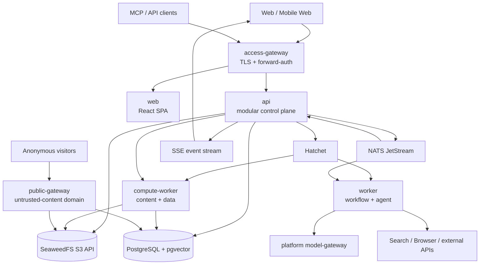
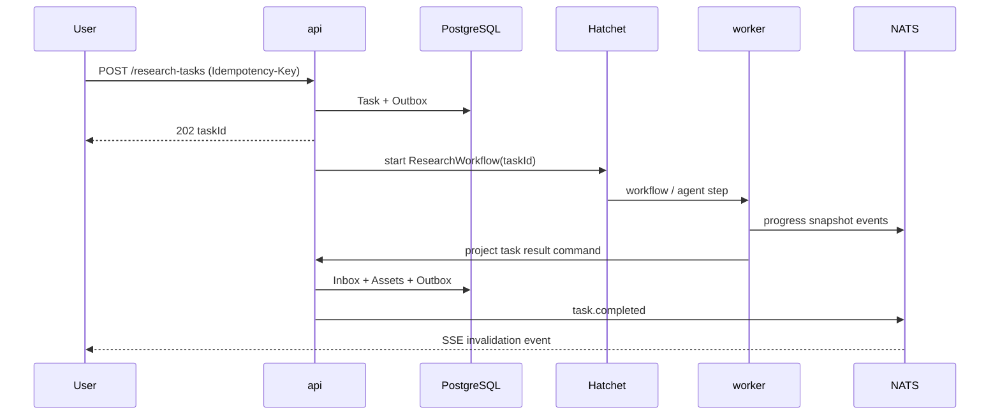

# Shiguang Asset Hub 总体技术架构

## 1. 文档目标

本文将立项书、PRD V1.0、72 张 UI 交互图和现有代码骨架转化为可实施的系统架构。设计目标不是把每个产品菜单拆成一个微服务，而是在 MVP 阶段建立稳定的领域边界，使高风险、高资源、不同扩缩容特征的能力可以独立部署。

## 2. 核心判断

### 2.1 架构风格

采用“模块化单体控制面 + 合并执行面 + 独立公开数据面 + 平台级公共服务”：

- 业务控制面集中在 `api`，以模块和数据库 schema 隔离领域，避免早期分布式事务。
- 长任务与 AI Agent 合并为 `worker`，内容处理与 Dataset 查询合并为 `compute-worker`；应用内部按 queue/profile 隔离资源。
- MCP 先作为 `api` 的独立路由模块；公开内容从首期使用独立 `public-gateway` 和域名。
- 统一认证、边缘接入和模型路由直接复用平台级服务，不在本仓库重复实现。



### 2.2 应用清单

| 应用 | 语言/框架 | 部署性质 | 核心职责 | 不承担 |
| --- | --- | --- | --- | --- |
| `web` | TypeScript、React、Vite | 无状态静态资源 | 产品 UI、编辑器、本地草稿、SSE 消费 | 权限裁决、HTML 直接执行 |
| `api` | Node.js、Fastify、Kysely | 无状态控制面 | 业务模块、权限、查询模型、REST、MCP Token/Tools | 长任务和重 CPU 处理 |
| `worker` | Node.js、Hatchet SDK、AI SDK | 持久执行面 | Workflow、Agent、Evidence、通知、补偿、定时任务 | 文件解析、最终业务落库 |
| `compute-worker` | Go、DuckDB | 计算执行面 | 文件解析/分块/导出、Parquet 导入/查询、Chart 数据 | 业务元数据、任意 SQL、公开请求 |
| `public-gateway` | Go | 公网高并发数据面 | Published URL、短链、密码、缓存、静态 HTML/演示分发、访问事件 | 编辑、管理 API、主站 Cookie |

应用详细设计见 `docs/apps/*.md`。

## 3. 领域边界

`api` 内部使用 Fastify plugin 封装模块，每个模块只有公开 application service 可以被其他模块调用：

```text
apps/api/src/modules/
├── identity/          # 平台身份断言解析、租户上下文
├── assets/            # Asset、Version、Relation、Folder、Tag、Trash
├── documents/         # Markdown/HTML 元数据、草稿同步、版本策略
├── knowledge/         # KB、Source、Chunk 查询、Ask/Citation
├── research/          # Research 配置、Plan、输出映射
├── tasks/             # 产品任务读模型、命令、进度、重试
├── datasets/          # Dataset 元数据、schema、compute-worker 门面
├── presentations/     # Slide document、Theme、Layout、发布物
├── templates/         # Research/Presentation 模板及版本
├── publishing/        # Release、Slug、访问策略、二维码
├── notifications/     # 站内通知和投递偏好
├── billing/           # 外部积分余额只读适配
├── integrations/      # API Token、MCP 配置、Git P1
└── audit/             # 高风险操作与安全审计
```

边界规则：

1. 模块不能直接引用其他模块的 repository；通过 application service 或领域事件协作。
2. 一次用户命令的强一致变更尽量在 `api` 的单个 PostgreSQL 事务完成。
3. 事务外副作用统一写入 `outbox_events`，由 relay 发布到 NATS/Hatchet。
4. Worker 的结果不能直接拼接 SQL 修改业务表；通过版本化 result command 回到 `api` 的 projector。
5. Asset 是跨模块引用的唯一稳定资源标识；Report、Dataset、Presentation 都是 Asset 的类型化扩展。

## 4. 同步与异步调用

### 4.1 同步路径

- Browser → `api`：REST/JSON；OpenAPI 3.1 是公开契约。
- Browser ← `api`：SSE 推送任务、通知、索引状态；断线后以 `Last-Event-ID` 续传。
- `api` → `compute-worker`：内部 ConnectRPC/gRPC，强类型 Dataset 查询请求，短超时和请求预算。
- MCP Client → `api/mcp`：Streamable HTTP；独立路由配额，不接受浏览器 Cookie，复用 application service。

### 4.2 异步路径

- 需要重试、等待、并发限制或跨分钟执行的命令提交给 Hatchet。
- 领域事实、进度快照、通知触发写入 NATS JetStream。
- 大载荷从不进入 NATS/Hatchet payload，只传 `objectKey`、`contentHash` 和签名元数据。



## 5. 数据与存储原则

- PostgreSQL 是业务事实、权限和任务读模型的唯一事实库；积分余额由外部积分系统提供。
- pgvector 保存知识分块 embedding；MVP 使用 PostgreSQL FTS/`pg_trgm` + vector RRF 混合检索。
- SeaweedFS 通过 S3 API 保存原始文件、Asset version 内容、Parquet、演示发布包和导出物。
- Dataset 行数据转为不可变 Parquet，`compute-worker` 的 data 模块用 DuckDB 查询；PostgreSQL 仅保存 schema、统计和版本元数据。
- 大文本也保存在对象存储；数据库保存必要摘要、hash、当前版本引用，避免 TOAST 无限制膨胀。
- 删除默认软删 30 天；对象物理清理由带保留期的 GC Workflow 完成。

详见 [data-architecture.md](./data-architecture.md)。

## 6. 身份与信任边界

- `access-gateway` 调用 `auth-service`，只向产品传递短时、audience-bound 的 `X-SG-Identity`。
- `api` 校验签名、issuer、audience、expiry，再建立 `ActorContext`；资源权限始终由产品判断。
- 公开 HTML/Presentation 使用独立可注册域名，例如 `*.assets.shiguangusercontent.com`，绝不能位于 `.shiguanglab.com`。
- MCP/API Token 只存 hash，明文只展示一次；默认 Read Only，按 Asset/KB/Workspace Scope 限制。
- Agent 工具使用任务级短时能力令牌，不获取用户 Cookie、Provider Secret 或数据库凭据。

详见 [security-and-permissions.md](./security-and-permissions.md)。

## 7. 可用性和性能目标

初始目标需在上线前经压测确认：

| 场景 | 目标 |
| --- | --- |
| 控制面读 API | P95 < 300 ms（不含 AI） |
| 控制面写 API | P95 < 500 ms，2 秒内可见读模型 |
| Dataset 首屏查询 | P95 < 1.5 s，100k 行 Parquet |
| 公共页面首字节 | 同区域 P95 < 200 ms，CDN 命中后 < 100 ms |
| 任务进度新鲜度 | 正常情况下 < 3 s |
| 自动保存 | 500–1000 ms debounce，离线草稿不丢失 |
| RPO / RTO | MVP：RPO ≤ 15 min，RTO ≤ 2 h；P1 再提升 |

## 8. 明确不拆的服务

MVP 不独立拆出 Asset Service、Knowledge Service、Publish Service、Billing Service、Notification Service。它们存在大量同事务写入和相同租户/权限约束，拆开只会引入分布式事务和重复鉴权。满足以下条件之一再拆：

- 独立团队长期负责；
- 资源或可用性目标显著不同；
- API/事件契约已稳定并能承受最终一致性；
- 单模块成为可测量的性能瓶颈；
- 安全边界要求独立凭据和网络策略。

## 9. 关键架构决策

| ADR | 决策 | 理由 |
| --- | --- | --- |
| ADR-001 | 控制面模块化单体 | MVP 范围广但团队/流量未知，优先事务一致性和迭代速度 |
| ADR-002 | Hatchet 管持久执行，NATS 管事件 | 避免自研状态机，也避免把事件总线当任务引擎 |
| ADR-003 | PostgreSQL + pgvector 起步 | 一套备份/事务体系满足当前规模，延迟引入专用搜索集群 |
| ADR-004 | SeaweedFS S3 抽象 | 可复用现有运维经验；Apache-2.0、持续维护；MinIO 社区仓库已归档 |
| ADR-005 | Dataset 使用 Parquet + DuckDB | 100k 行交互分析不需要 ClickHouse，列式文件便于版本化和迁移 |
| ADR-006 | 公共数据面独立 Go 网关 | 高缓存命中、高并发、匿名访问和不可信内容需独立故障/安全域 |
| ADR-007 | MCP 首期并入 API 独立路由组 | 复用授权与业务逻辑；以连接/流量配额隔离，指标触发后再拆进程 |
| ADR-008 | 首期固定 5 个应用 | 以 profile/queue 隔离负载，避免为逻辑模块提前增加部署单元 |

## 10. 关联文档

- [数据架构](./data-architecture.md)
- [基础设施选型](./infrastructure-selection.md)
- [安全与权限](./security-and-permissions.md)
- [契约与事件](./contracts-and-events.md)
- [部署与可靠性](./deployment-and-reliability.md)
- [Superagents 复用评估](./superagents-reuse-assessment.md)
- [实施路线图](./implementation-roadmap.md)
